# DataScience

- [ Curso Basico de Python](#BasicoPython)
- [Curso de Fundamentos de Álgebra Lineal con Python](#CursodeFundamentosdeÁlgebraLinealconython)
- [Curso de Estadística Computacional con Python](#CursodeEstadísticaComputacionalconPython)
- [Curso Profesional de Python](#CursoProfesionaldePython)
- [Git](#Git)
- [Terminal](#Terminal)
- [Anaconda](#Anaconda)
- [Excel](#Excel)
- [PostgreSQL](#PostgreSQL)
- [SQL Y MYSQL](#SQLYMYSQL)
- [ORACLE DATABASE](#ORACLEDATABASE)
- [LINUX](#LINUX)
- [Pandas](#Pandas)
- [Numpy](#Numpy)
- [DATAWAREHOUSE- ETL - CUBO OLAP - EFESTO](#Datawarehouse)
- [matplotlib](#matplotlib)
- [SeaBorn](#SeaBorn)
- [PowerBi](#PowerBi)
- [mario F triola](#marioFtriola)
- [Algebra](#Algebra)
- [Probabilidad](#Probabilidad)


## BasicoPython
- Python un lenguaje que podemos aprender para iniciarnos en la ingeniería de software. Es utilizado en Drones, Autos autónomos y hasta cohetes, nos rodea por todos lados.

- Razones por iniciarse con Python

  - El lenguaje con mayor crecimiento
  - Es el curso ideal si no tienes ningún contacto con la programación o ya dominas algún lenguaje y quieres aprender más.
  - Su forma de escribir es elegante y simple
  - La programación está en todos lados
  - Programar es darle instrucciones a la computadora para que resuelva un problema.
  - La industria de tecnología es una de las que tienen mayor crecimiento.
- Un algoritmo es una serie de pasos ordenados para resolver un problema. Este es finito, ordenado, y no ambiguo.
- Las características fundamentales que debe cumplir todo algoritmo son:

  - Un algoritmo debe ser preciso e indicar el orden de realización de cada paso.
  - Un algoritmo debe estar definido. Si se sigue un algoritmo dos veces, se debe obtener el mismo resultado cada vez.
  - Un algoritmo debe ser finito. el algoritmo se debe terminar en algún momento; o sea, debe tener un número finito de pasos.
  - Un algoritmo debe ser legible: El texto que lo describe debe ser claro, tal que permita entenderlo y leerlo fácilmente.
- 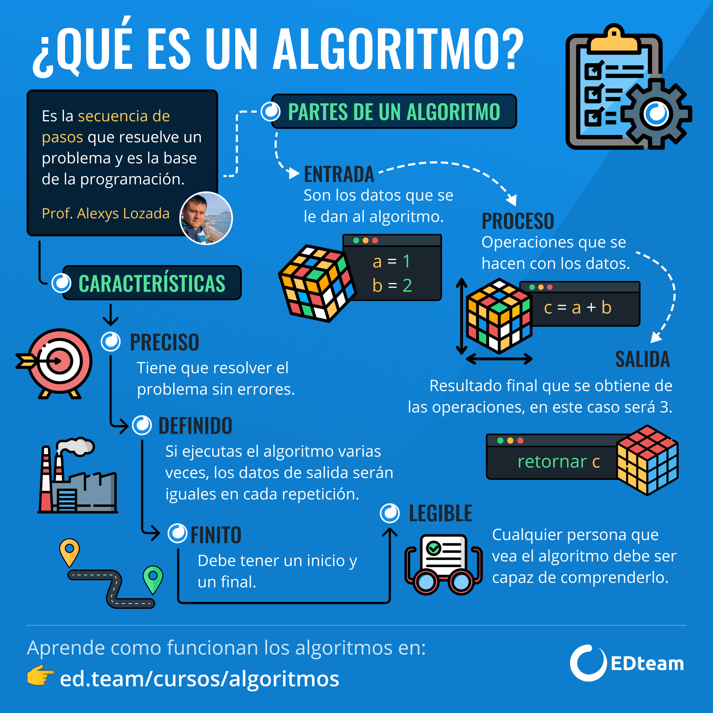

### Operaciones Aritmeticos
- Suma: 5 + 5
- Resta: 5 - 5
- Multiplicación: 5 * 5
- División (con decimales): 5 / 5
- División (sin decimales): 21 // 5
- Resto de la división: 21 % 5
- Potencia: 2 ** 2
- Raíz cuadrada:
```py
>>> math.sqrt(9)     
>>> 3.0
>>> math.sqrt(11.11)   
>>> 3.3331666624997918
>>> math.sqrt(Decimal('6.25'))     
>>> 2.5
```
### Que es una variable
- Una variable es un lugar en memoria (una especie de caja) en el que podemos guardar objetos (números, texto, etc). Esta variable posee un identificador o nombre con el cual podemos llamarla más tarde cuando la necesitemos.
- Tipos de variables en Python:
  - a = 28 → int (entero)
  - b = 1.5 → float (decimales)
  - c = “Hello” → str (string o cadena de texto)
  - d = True → boolean (verdadero o falso)
  - e = None → NoneType (Sin valor)
  - f = “5” → str (5 y “5” no son lo mismo. La primera es un entero y la segunda una cadena de texto)
```py
>>> a = 1     
>>> b = 2
>>> c = a + b
>>> print (c)
>>> 
```
- Concatenando se pone entre comillas
```py
>>> a = 'ella'    
>>> b = 'no'
>>> c = 'te ama'
>>> d = a+b+c
>>> print (d)
>>> Ella no te ama
```
### Convertir un dato a un tipo diferente
- int(var) variable a entero
- float(var) variable a flotante
- str(var) variable a texto
- bool(var)variable a booleano
- abs(var) variable a valor absoluto
```py
>>> number1 = int(input("Escribe un numero: "))
Escribe un numero: 100
>>> number2 = int(input("Escribe otro numero: "))
Escribe otro numero: 300
>>> number1 + number2
=> 400
```
- Input("") para pedirle al usuario que introduzca datos.

- int() con datos o variables dentro de parentesis para convertirlo en número entero.

- str() para convertir números tanto decimales como enteros a strings.
### Operadores logicos y de comparacion
- and para comparar si dos valores son verdaderos.
- or para comparar si dos valores son falsos.
- not para invertir el valor booleano.
- == Compara dos valores y te dice si son iguales o no.
- != Compara dos valores y te dice sin son diferentes o no.
- -> Compara si es mayor que otro valor.
- -> Compara si es menor que otro valor.
- >= igual o mayor que el valor a comparar.
- <= igual o menor que el valor a comparar.

## Programa conversor de monedas
```py
def exchanges(moneda,cantidad):
    result = 0
    # Moneda chilena
    if moneda == 1:
        result = cantidad * 0.0013
        print(f'Los {cantidad} pesos chilenos equivalen a {result} dolares')
    # Moneda colombiana
    elif moneda == 2:
        result = cantidad * 0.00027
        print(f'Los {cantidad} pesos colombianos equivalen a {result} dolares')
    # Moneda Argentina
    elif moneda == 3:
        result = cantidad * 0.014
        print(f'Los {cantidad} pesos argentinos equivalen a {result} dolares')
    # Moneda mexicana
    elif moneda == 4:
        result = cantidad * 0.044
        print(f'Los {cantidad} pesos mexicanos equivalen a {result} dolares')
    # Otro
    else:
        print('Ingresa solo un numero de la lista')


if __name__ == '__main__':
    try:
        moneda = int(input('''
        Ingresa el indice de la moneda que quieres convertira  dolar:
            [1] Moneda chilena a Dolar
            [2] Moneda colombiana a Dolar
            [3] Moneda argentida a Dolar
            [4] Moneda mexicana a Dolar
        Selecciona: '''))
        print('********************************')
        cantidad = int(input('Ingresa la cantidad que quieres convertir: '))
        exchanges(moneda,cantidad)
    except:
        print('* * * * * * E R R O R * * * * * *')
        print('Por favor, Ingresa solo valores numericos')
```
### condicionales
- if
(Si) se usa para la condición principal.

- elif
(Si no) en caso de que la condición principal o anterior no se cumpla, se puede utilizar para agregar otra condición.

- else
(Sino) en caso de que la(s) condición(es) anterior(es) no se cumplan, se ejecuta como alternativa sin condicional.
```py
nacionalidad = input("¿Eres peruano? (Responde sí o no) ")
if nacionalidad == "sí":
    cambio_a_soles = 3.9865
    dolares = str(round(float(input("¿Cuántos soles tienes? "))/cambio_a_soles, 2))
    print("Entonces tienes " + dolares + " dólares.")
elif nacionalidad == "no":
    cambio_a_dolares = 0.25298
    soles = str(round(float(input("Bienvenido a Perú. ¿Cuántos dólares tienes? "))/cambio_a_dolares, 2))
    print("Entonces tienes " + soles + " soles.")
else:
    print("Escribe sólo sí o no, por favor. ")

```
```py
numero = input('Escribe un número: ')
numero = float(numero)

if numero > 5:
  print('Es mayor a cinco.')
elif numero == 5:
  print('Es igual a cinco.')
else:
  print('Es menor a cinco.')
  ```
  - convirtiendo con opciones
```py
from tkinter import Menu


Menu = """
Bienvenido al conversor de monedas
1.- Soles peruanos
2.- Pesos argentinos
3.- Pesos colombianos

Choose a option: """

opcion = int(input(Menu))
if opcion == 1:
    soles = input("¿Cuantos soles tienes?:")
    soles = float(soles)
    valor_dolar = 3.875
    dolares = soles/valor_dolar
    dolares = str(dolares)
    print("Tienes:"+dolares+"dolares")
elif opcion == 2:
    pesos = input("¿Cuantos pesos tienes?:")
    pesos = float(pesos)
    valor_dolar = 3.875
    dolares = pesos/valor_dolar
    print("Tienes"+dolares+"dolares")
else:
    print('Ingresa un numero correcto')
  ```
- 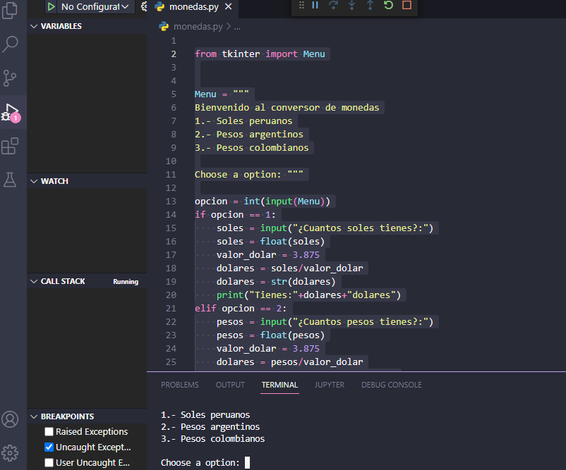

### Aprendiendo a no repetir código con funciones
- Las funciones ayudan a optimizar el código. Es decir, utilizar la menor cantidad de líneas dentro del código y evitar escribir acciones repetitivas.

- Esto nos sirve para entregar un código más limpio y con buenas prácticas, que no desperdicia recursos innecesariamente. En Python, para definir funciones empleamos def.

- Gracias a def, podemos “definir” funciones que emplearemos más tarde. Una función, en programación, es un grupo de instrucciones con un objetivo en particular y que se ejecuta cuando es “invocada”.
```py
def conversacion(opcion):
    print('Hola')
    print('Cómo estás')
    print('Elegiste la opcion: ' + str(opcion))
    print('Adiós')

opcion = int(input('Ingrese una opción (1, 2, 3): '))

if opcion == 1:
    conversacion(opcion)

elif opcion == 2:
    conversacion(opcion)

elif opcion == 3:
    conversacion(opcion)

else:
    print('Escribe una opción correcta.')

```

### funciones
- Una función es un bloque de código que realiza alguna operación. Una función puede definir opcionalmente parámetros de entrada que permiten a los llamadores pasar argumentos a la función. Una función también puede devolver un valor como salida.
```PY
from tkinter import Menu
def conversor(tipo_pesos, valor_dolar):
    pesos = input("cuantos pesos" + tipo_pesos + "tienes?:")
    pesos = float(pesos)
    valor_dolar = 3.384
    dolares = pesos/valor_dolar
    dolares = str(dolares)
    print("Tienes $" + dolares + "dolares")
menu = """
Bienvenido al conversor de monedas
1.- Soles peruanos
2.- Pesos argentinos
3.- Pesos colombianos
Elige una opcion:"""
opcion = int(input(menu))

if opcion == 1:
    conversor("colombianos",3.789)
else:
    print("ELIGE UNA OPCION CORRECTA")
```
### Trabajando con texto: cadenas de caracteres
- Para trabajar con cadenas de texto en Python, vamos a aplicar una serie de métodos a las variables que hayamos creado anteriormente.
Método: es una función especial, que existe para un tipo de dato en particular. Por ejemplo, si queremos que el texto ingresado se transforme en mayúsculas.
- Métodos para trabajar con texto en Python:
  - variable.strip(): El método strip eliminará todos los caracteres vacíos que pueda contener la variable

  - variable.lower(): El método lower convertirá a las letras en minúsculas.

  - variable.upper(): El método upper convertirá a las letras en mayúsculas.

  - variable.capitalize(): El método capitalize convertirá a la primera letra de la cadena de caracteres en mayúscula.

  - variable.replace (‘o’, ‘a’): El método replace remplazará un caracterer por otro. En este caso remplazará todas las ‘o’ por el caracter ‘a’.

  - len(variable): Te indica la longitud de la cadena de texto dentro de la variable en ese momento.
  ```py
  >>> nombre = input ("writte your name: ")
  writte your name: jonathan
  >>> nombre
  'jonathan'
  >>> nombre.upper()
  'JONATHAN'
  >>> nombre.lower()
  'jonathan'
  >>> nombre.strip()
  'jonathan'
  >>> nombre.capitalize()
  'Jonathan'
  ```
### Trabajando con texto: slices
- En Python, los slices, traducidos al español como “rebanadas”, nos permiten dividir los caracteres de un string de múltiples formas. A continuación, realizaremos un ejemplo cómo utilizarlos:
```py
>>> nombre = "Francisco"
>>> nombre
>>> "Francisco"
>>> nombre[0 : 3]
El resultado sería
"Fra"
```
### Bucles
- Un bucle es un ciclo continuo en todos los lenguajes de programación que nos permite iterar sobre nuestros pasos: magina un contador cíclico (1,2,3,4,5,6…) donde puedes agregar un paso más sobre tu programa principal.
- Ejemplo de bucle en la vida real
  - Despertar
  - Estudiar en Platzi
  - Comer
  - Dormir
  ```py
    >>> def potencia(numero):
    
    potencia = 1

    while (potencia <= 10):
        
        result = numero ** potencia
        print('Potencia de {} elevado a la {} es {}'.format(numero, potencia, result))
        potencia += 1
        

    >>>  def run():
    numero = int(input('Escribe el numero al cual quieres averiguarle la potencia: '))
    potencia(numero)


    if __name__ == "__main__":
        run()

  ```
- Nos va salir 10 resultados
### bucle while
- Un bucle while permite repetir la ejecución de un grupo de instrucciones mientras se cumpla una condición (es decir, mientras la condición tenga el valor True).

- La sintaxis del bucle while es la siguiente:

  ```py
    def run():
    LIMITE = 1000000
    contador = 0
    potencia_2 = 2**contador
    while potencia_2 < LIMITE:
        print('2 elevado a ' + str(contador) +
              ' es igual a: ' + str(potencia_2))
        contador = contador + 1
        potencia_2 = 2**contador

    if __name__ == "__main__":
        run()

    ```

    ```py
        contador = 1
        print(contador)
        while contador < 1000:
            contador = contador + 1
            print(contador)
    ```
- cuenta del 1 a 1000
### for
- El ciclo for es un tipo de bucle usado cuando se conozcan la cantidad de veces a iterar.

- Un contador es una variable que se encarga de contener valores que irán incrementando o decrementando cada vez que se ejecuta una acción que lo contenga. El incremento o decremento es llamado paso del contador y es siempre constante.

- Ejemplo: El marcador de un partido de fútbol, cada vez que un equipo anote un gol, aumenta su marcador en una unidad.
- Su sintaxis es:
  - variable = variable + constante(al incrementar)
  - variable = variable - constante(al decrementar)

- o de manera resumida:

  - variable += constante
  - variable -= constante
    ```py
    for i in range(10):
        print(i)
    ```
### Proyecto final generador de contraseñas
```py
    import random
import string

def generate_password():
    # capitalize = ['A','B','C','D','E','F','G','H','I','J','K','L','M','N','O','P','Q','R','S','T','Y','X','Y','Z']
    # lowercase = [letter.lower() for letter in capitalize] 
    # symbols = ['?','¡','¿','%','&','$','#','/','!','+','[']
    # numbers = ['1','2','3','4','5','6','7','8','9','10']

    # characters = capitalize + lowercase + symbols + numbers

    characters = string.ascii_lowercase + string.ascii_uppercase + string.digits + string.punctuation

    password = []

    for i in range(15):
        character_random = random.choice(characters)
        password.append(character_random)

    password = "".join(password)

    return password


def run ():
    password = generate_password()
    print('Your new password is: ' + password)

if __name__ == '__main__':
    run()
```
## CursodeFundamentosdeÁlgebraLinealconython
- El álgebra lineal es una rama de las matemáticas que estudia conceptos tales como vectores, matrices, espacio dual, sistemas de ecuaciones lineales y en su enfoque de manera más formal, espacios vectoriales y sus transformaciones lineales.
- Por qué Python para Data Science:
  - Si ya conoces el lenguaje Python no hace falta que te cuente porque es el elegido en la industria para dar vida a los proyectos de Data Science. Pero si no estás familiarizado con Python estas son algunas de sus características:

   - Es poderoso y sencillo
   - Tiene múltiples paquetes estadísticos y de aprendizaje automático, listos para usar
   - Una comunidad muy activa a la que siempre puedes consultar
- Por qué Anaconda:
  - Anaconda nos provee de una plataforma muy completa para poder desarrollar nuestros proyectos de Data Science, simplifica la tarea de instalación y configuración de las distintas aplicaciones que necesitaremos usar en nuestro viaje. Podemos utilizarlo tanto por terminal como por interfaz gráfica (GUI). Por el momento avancemos con la segunda opción, es más amigable para quien no está acostumbrado a la línea de comandos.
  - Instalacion:
  - Ir a https://www.anaconda.com/distribution/
  - Selecciona tu versión de Sistema Operativo: Windows - macOS - Linux
  - Haz click en Descargar/Download “Python 3.7 version” (o click en la versión adecuada para tu CPU 64-bit o 32-bit)
- Iniciando Anaconda
Una vez que finalizada la instalación debes abrir el programa Anaconda Navigator para que podamos crear el entorno en cual estaremos estudiando y actualizar los paquetes.

- Haz click en Environments y despues click en +Create. Se abrirá una ventana para crear un nuevo entorno.
- 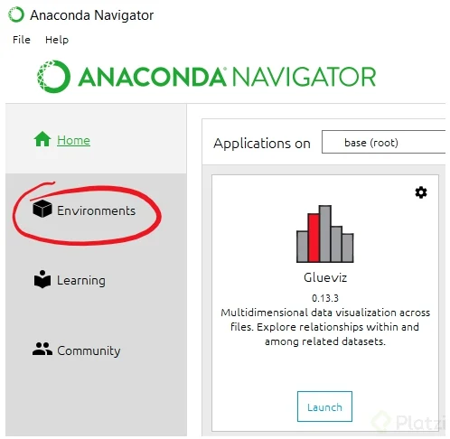
- Llena los siguientes campos:
- 
- Name: jacob - FundamentosAL
- Packages: tilde en Python y del menú desplegable selecciona 3.7
- 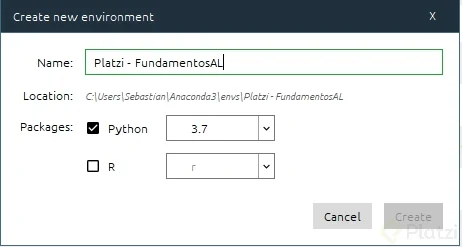
- momento para configurar el nuevo entorno y actualizarlo. Cuando termine verás una pantalla similar a esta
- 
- Los paquetes que ves son los que están instalados por defecto, necesitas instalar varios más. Haz click en installed y cambiarlo a not installed.
- 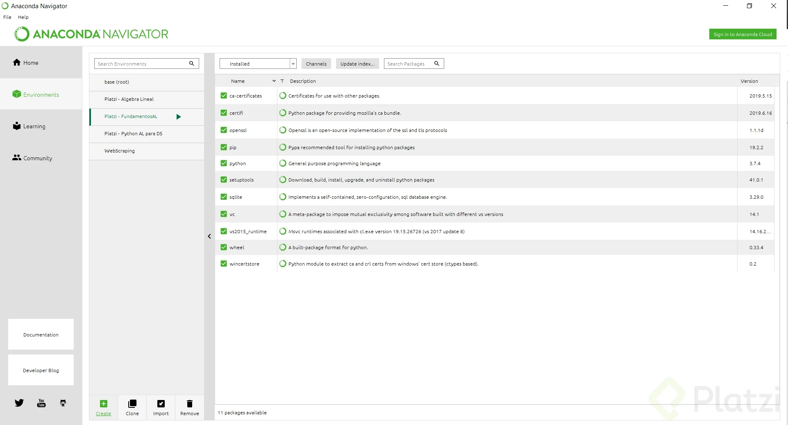
- En el recuadro de search packages pon:

   - Jupyter Notebook
   - scipy (tambien instalará numpy)
   - pillow (libreria para manejo de imágenes)
   - imageio (lectura / escritura de imágenes)
   - matplotlib (para graficar)
   - seaborn (visualizaciones estadísticas)
   - scikit-learn (aprendizaje automático - lo usaremos para un ejemplo de PCA)
- Una vez finalizada la instalacion y actualizacion de paquetes en el entorno Platzi - FundamentosAL hacemos click en Home, y Launch Jupyter Notebook. Una nueva pestaña se abrirá en nuestro navegador con Jupyter, ya estamos listos para comenzar el aprendizaje de Fundamentos de Álgebra Lineal con Python.
- EJERCICIO
 - Instala el paquete seaborn. Es un paquete para visualizar datos.
   - 1 - Desde Anaconda Navigator, haz click en Environments
   - 2 - Selecciona el entorno donde quieres instalar el paquete (Jacob - FundamentosAL)
   - 3 - Selecciona en el menú desplegable Not Installed
   - 4 - Escribe en el recuadro de búsqueda seaborn
   - 5 - Haz click en el paquete seaborn
   - 6 - Haz click en Apply
   - 7 - Haz click en Apply, pero esta vez en el pop up que aparece para aceptar todas las dependencias.
- copia el siguiente codigo:
    ```js
        import seaborn as sns
        vuelos = sns.load_dataset("flights")
        vuelos = vuelos.pivot("month", "year", "passengers")
        ax = sns.heatmap(vuelos)
    ```
- A los que no les aparezcan los paquetes en “Not Installed”, sólo tienen que darle a “Update index…”.
- Para ejecutar el código de arriba deben instalar Jupyter Lab, se van a home ejecutan Launch de Jupyter Lab, seleccionan Python 3 y pegan el código esperan un momento y les aparecerá el gráfico.
- 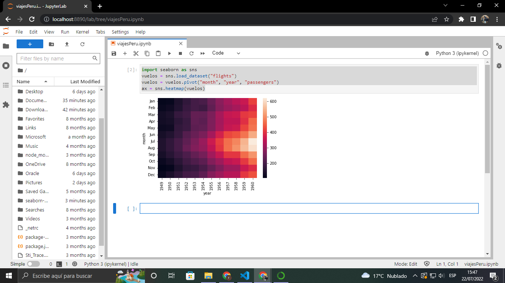
- primero codigos:
    ```py
    print ('hello world')


    from platform import python_version
    print(python_version())

    ```
- comentamos con #
- ejecutar notebooks dentro de otros: %run "archivo_funciones.ipynb"

### Creando las bases, escalares, vectores y matrices. ¿Qué es un tensor? ¿Cómo se representa?
- Escalar = numero
- Vector = un lugar donde se colocan muchos numeros
- Matrices = muchos vectores apilados - filas y comulnas
- Tensor = muchas matrices se mueve entre filas y columnas entre matrices

- import numpy as np
    - numpy significa numerical python
- 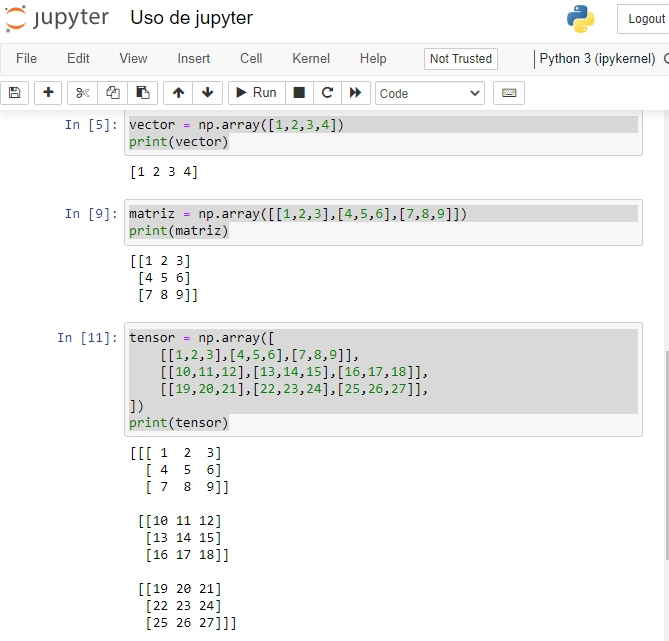
- interpolacion la union de espacios en un punto
- 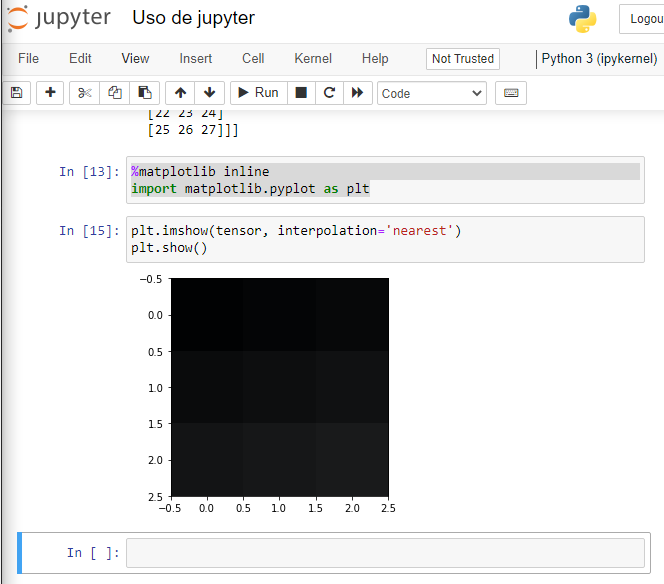
- 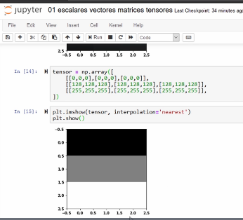
- shape : nos indica de cuanto es la matriz 3*3
- size : nos da el tamaño total de la matriz 9
- len: nos dice cuantos elementos hay en la primera columna
- 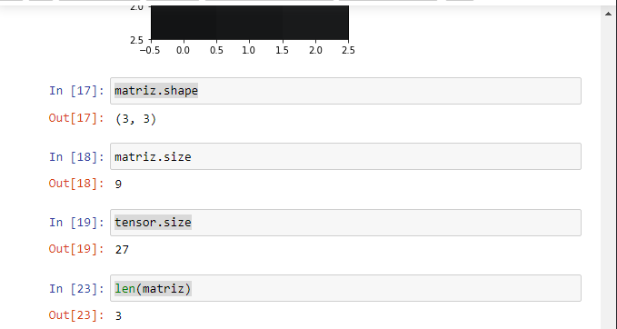

### transponer
- Transponer: es cambiar filas por columnas
- 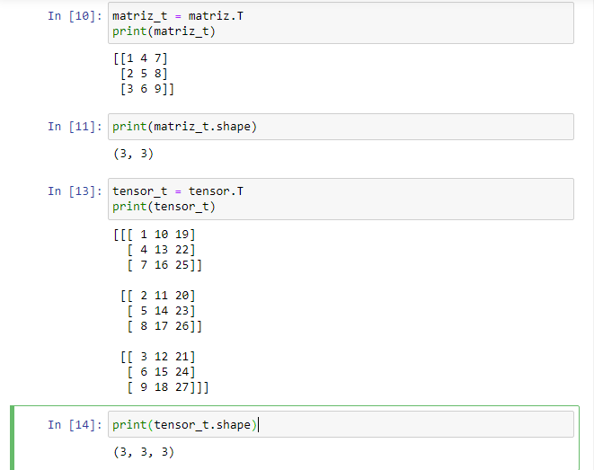
### Suma de matrices
- 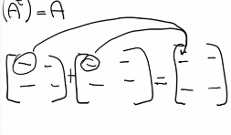
- se suma cada x y y y se le pone en la nueva matriz
- ojo: la matrices deben tener la misma dimecion es decir si es de : 2x2 y la otra matriz de 2x2 si se podra realizar la operacion igual de 3x3 y sucesivamente
 - 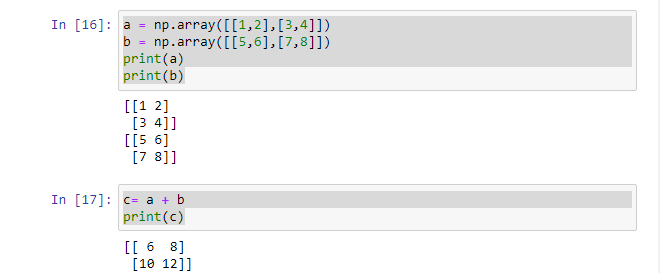

 ### Producto interno entre una matriz y un vector
- multiplicar una matriz por un vector:
 - 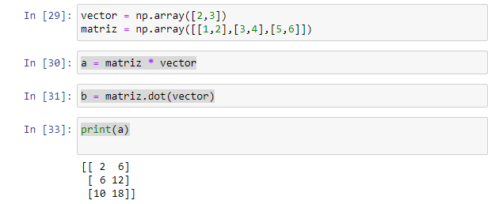
- producto interno:
 - 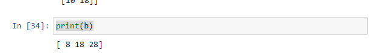

### Propiedades de las matrices: la multiplicación de matrices es asociativa y distributiva, no es conmutativa
- 
- 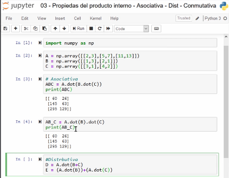

### Cómo comprobar la solución de un sistema de ecuaciones lineal
- En esta clase aprenderemos cómo plantear un sistema de ecuaciones de forma matricial y realizar el proceso para comprobar su solución. Al final nos preguntaremos si existe una operación o elemento para realizar la **división **entre matrices para obtener la solución de un sistema de ecuaciones.
- ACLARACION: Al final de la clase el profesor hace un despeje dudoso ya que se esta trabajando con matrices, como tenemos Ax = b = (Matriz 2x2)(Matriz 2x1) = (Matriz 2x1). Lo correcto para despejar la matriz (o vector) x seria multiplicar por la izquierda la inversa de A y por tanto nos quedaria como: x = A_inv * b
- 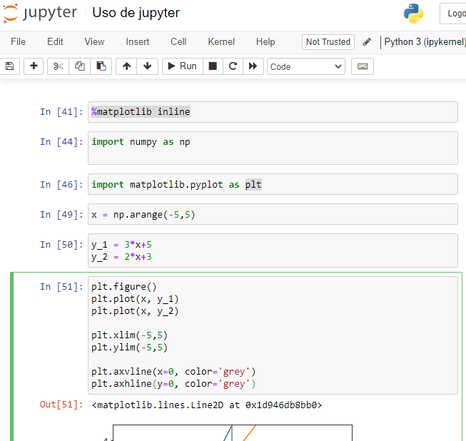
- 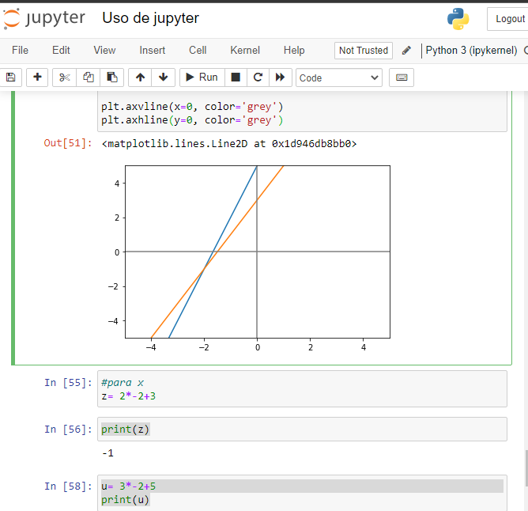
- calculo manual:
- 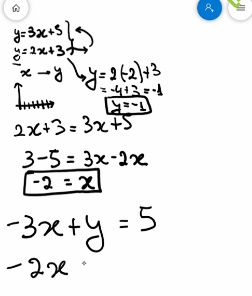

###  sistemas sin solución, con una solución y con infinitas
- 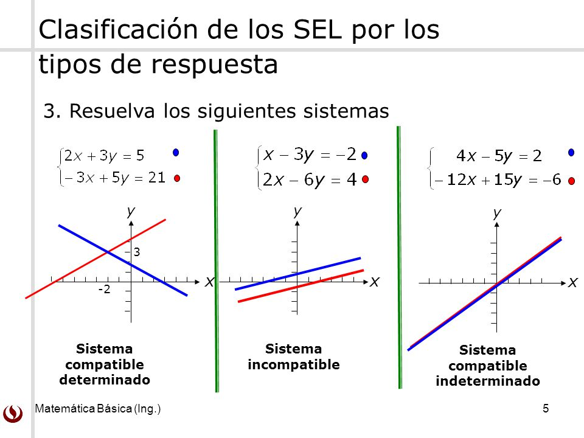
### Grafica de vectores
-  un vector​ es un ente matemático como la recta o el plano. Un vector se representa mediante un segmento de recta, orientado dentro del espacio euclidiano tridimensional. El vector tiene 3 elementos: módulo, dirección y sentido.​
```py
    %matplotlib inline

    import numpy as np
    import matplotlib.pyplot as plt

    v1 = np.array([2,5])
    v2 = np.array([3,2])

    # vecs: vectores.
    # cols: colores.
    # alpha: valor de transparencia.
    def graficarVectores(vecs, cols, alpha=1):
        plt.figure()
        plt.axvline(x=0, color="grey", zorder=0)
        plt.axhline(y=0, color="grey", zorder=0)
        
        for i in range(len(vecs)):
            # El origen de los vectores inicia en el punto (0,0)
            x = np.concatenate([[0,0], vecs[i]])
            plt.quiver([x[0]],
                    [x[1]],
                    [x[2]],
                    [x[3]],
                    angles='xy', scale_units='xy', scale=1, 
                    color=cols[i], alpha=alpha)

    graficarVectores([v1,v2], ['orange', 'blue'])
    # Definimos los limites
    plt.xlim(-1, 8)
    plt.ylim(-1, 8)
```
- 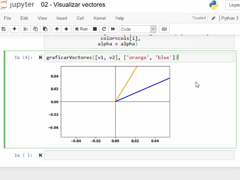

## CursodeEstadísticaComputacionalconPython
- Programacion dinamica:
  - La programación dinámica es la optimización de un algoritmo mediante el desarrollo de subsistemas que van a reducir su tiempo de ejecución.
- fibonacci dinamico:
  ```py
    
    def fibonacci_dinamico(n, memo = {}):
        if n == 0 or n == 1:
            return 1

        try:
            return memo[n]
        except KeyError:
            resultado = fibonacci_dinamico(n-1)+fibonacci_dinamico(n-2)
            memo[n] = resultado
            return resultado
    if __name__ == '__main__':
        n = int(input('Escoge un numero: '))
        resultado = fibonacci_dinamico(n)
        print(resultado)

   ```
### caminos aleatorios
- Es un tipo de desicion que elige aleatoriamente una decision dentro de un conjunto de decisiones validas.
- Lugares dónde utilizaría los caminos aleatorios:
   - clima
   - valor de los pasajes aereos
   - inflación
   - valor del bitcoin
   - reacción del público ante un nuevo producto
   - Algunas aplicaciones:
   - Arribo de clientes a un banco / Peticiones de Clientes a un Servidor 
   - Tiempo de atención de un reclamo 
   - Teoría de Colas 
   - Simulación de Sistemas.
   - Ofertas en Subastas.
   - Cantidad de Defectos por Artículo Producido
   - Distribución Poisson 
   - Control de Calidad
   - Auditoria de expedientes 
   - Muestra sin Reposición.
   - Cálculo de Area para curvas no Diferenciales.
   - Ruta crítica de un proyecto, escenario de pésimo, moderado y optimista de tareas 
   - Distribución Triangular, por ejemplo.
   - Diseño de Experimentos 
   - Factores aleatorios
   - Machine Learning.
   - Video Juegos, juegos de apuestas virtuales.
### Entendiendo la aleatoriedad con Python
- caso de borrachos
  - Un borracho
  - Donde se mueve el borracho
  - Coordenadas
- Si lo queremos ver en términos de programación orientada a objetos; nos podemos imaginar al borracho cómo alguien que se mueve, el campo como si fuera un mapa y la coordenada como un pointer adentro de este mapa.
- Otra cosa bien interesante es que dentro de la programación orientada a objetos es que nosotros podemos generar una jerarquía, y la jerarquía básicamente es como nosotros  podemos expandir cosas generales que hereden de un padre.
- 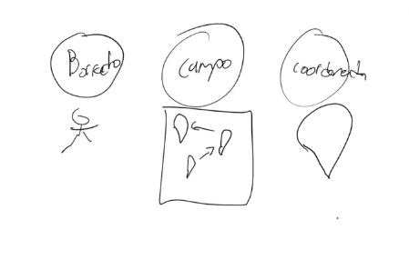
- En ese código se usó el enfoque de POO 💩.
- Se tienen 3 clases: borracho, campo y coordenada. Una subclase de borracho es borracho tradicional, el cual se puede mover aleatoriamente hacia arriba, derecha, izquierda y abajo con igual probabilidad.
- Dado que inicia en $(0, 0)$, nos interesa conocer donde está después de $n$ pasos. Al final, para ver donde termino, podemos usar la distancia euclidiana. .- Dado que es aleatorio, no se aleja tanto del centro.
- Si corremos solo la simulación una vez para cada $n$, no podríamos conocer el promedio y el comportamiento general, debemos correrlo varias veces (como si lanzáramos un dado). En el ejemplo lo hacemos 100 veces (intentos).
- En general, en cada simulación, podemos esperar resultados diferentes, pero el promedio será siempre el mismo.
Este es un ejercicio donde empezando desde un punto 0 **aleatoriamente** podemos decidir que dirección tomar, dependiendo de las opciones establecidas.

<div align="center"> 
  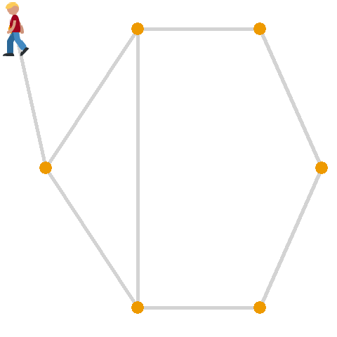
</div>

Para realizar un ejemplo de aleatoriedad vamos a crear un programa que representara el problema del "Camino de Borrachos". Para esto crearemos 3 clases: uno que represente al **agente que camina**, una que genere una **abstracción de las coordenadas** y una que represente el **plano** en el cual nos estamos moviendo, y vamos a graficar la distancia en la que termina nuestro agente a medida que definimos una mayor cantidad de pasos que puede dar. 

Primero crearemos un ambiente virtual, para ello vamos a la terminar.

```bash
mkdir camino_de_borramos    # Creamos una carpeta para nuestro proyecto.
cd camino_de_borrachos      # Ingresamos a la carpeta.
python3 -m venv env         # Creamos nuestro ambiente virtual.
source env/bin/activate     # Activamos nuestro ambiente.
pip install bokeh           # Instalamos el paquete de bokeh para generar nuestra gráfica.
```

Luego de haber creado nuestro entorno de trabajo creamos los siguientes archivos en nuestra carpeta.

```py
# Creamos un archivo borracho.py
import random

# Creamos nuestra Clase borracho.
class Borracho:

    def __init__(self, nombre):
        self.nombre = nombre


# Creamos la clase BorrachoTradicional que extiende de Borracho.
class BorrachoTradicional(Borracho):

    def __init__(self, nombre):
        super().__init__(nombre)

    # Y tendrá un método caminar que devolverá la dirección a la que ira.
    def camina(self):
        # Con random.choice elegimos un elemento aleatoriamente de la lista.
        return random.choice([(0, 1), (0, -1), (1, 0), (-1, 0)])
```

```py
# Creamos un archivo coordenada.py

# La clase Coordenada guardara las coordenadas de nuestro agente
class Coordenada:

    # Definimos unas posiciones iniciales.
    def __init__(self, x, y):
        self.x = x
        self.y = y

    # Y cuando se mueve simplemente a las coordenadas actuales se les
    # suma las coordenadas X e Y que ingresan como parámetros.
    def mover(self, delta_x, delta_y):
        return Coordenada(self.x + delta_x, self.y + delta_y)


    # Y si queremos saber la distancia del agente con respecto a
    # unas coordenadas, simplemente lo calculamos con el
    # teorema de Pitágoras.
    def distancia(self, otra_coordenada):
        delta_x = self.x - otra_coordenada.x 
        delta_y = self.y - otra_coordenada.y 

        return (delta_x**2 + delta_y**2)**0.5
```

```py
# Creamos un archivo campo.py
class Campo:

    # Nuestra clase tendrá como atributo un diccionario.
    def __init__(self):
        self.coordenadas_de_borrachos = {}


    # Añadimos un agente a nuestro diccionario, nuestra llave sera
    # nuestro parámetro "borracho" y tendrá el valor asignado "coordenada"
    # que es una clase Coordenada creado en coordenada.py.
    def anadir_borracho(self, borracho, coordenada):
        self.coordenadas_de_borrachos[borracho] = coordenada


    def mover_borracho(self, borracho):
        # Al mover a nuestro agente ejecutamos el método camina de
        # nuestra clase BorrachoTradicional creado en el archivo borracho.py,
        # devolviendo la dirección hacia donde se movió.
        delta_x, delta_y = borracho.camina()

        # Obtenemos el objeto de Coordenada.
        coordenada_actual = self.coordenadas_de_borrachos[borracho]

        # Del objeto Coordenada ejecutamos el método mover con los parámetros
        # que el objeto borracho genero. El resultado lo guardamos en
        # nueva_coordenada.
        nueva_coordenada = coordenada_actual.mover(delta_x, delta_y)

        # El objeto guardado en nueva_coordenada ahora estará asociado
        # a la llave de borracho.
        self.coordenadas_de_borrachos[borracho] = nueva_coordenada


    def obtener_coordenada(self, borracho):
        return self.coordenadas_de_borrachos[borracho]
```

```py
# Creamos el archivo camino_aleatorio.py

# Importamos las clases que creamos anteriormente.
from borracho import BorrachoTradicional
from campo import Campo
from coordenada import Coordenada

# Importamos bokeh para generar un gráfico con nuestros resultados.
from bokeh.plotting import figure, show


def caminata(campo, borracho, pasos):
    # De la instancia Campo obtenemos las coordenadas actuales de la llave "borracho".
    inicio = campo.obtener_coordenada(borracho)

    # Repetiremos la misma cantidad de pasos definidos.
    for _ in range(pasos):

        # De la instancia campo ejecutaremos mover_borracho.
        campo.mover_borracho(borracho)

    # Y devolveremos la distancia entre las coordenadas de la instancia
    # inicio y campo.
    return inicio.distancia(campo.obtener_coordenada(borracho))


def simular_caminata(pasos, numero_de_intentos, tipo_de_borracho):

    # Definimos los parámetros para crear una instancia de Campo.
    borracho = tipo_de_borracho(nombre='Karl')
    origen = Coordenada(0, 0)

    # Creamos una lista que guardara las distancias en cada simulación.
    distancias = []

    # Por cada numero de intento.
    for _ in range(numero_de_intentos):

        # Creamos una instancia de Campo.
        campo = Campo()

        # A nuestra instancia de Campo le damos la llave borracho y sus coordenadas de origen.
        campo.anadir_borracho(borracho, origen)

        # Obtenemos la distancia final de la simulación.
        simulacion_caminata = caminata(campo, borracho, pasos)

        # El resultado lo guardamos en la lista de distancias.
        distancias.append(round(simulacion_caminata, 1))
    
    # Retornamos la lista de distancias.
    return distancias


def graficar(x, y):
    # Creamos una instancia de figure, con su titulo y las etiquetas de los ejes.
    grafica = figure(title='Camino aleatorio', x_axis_label='pasos', y_axis_label='distancia')

    # Ingresamos los datos de X e Y.
    grafica.line(x, y, legend='distancia media')

    # Generamos una gráfica en HTML.
    show(grafica)


def main(distancias_de_caminata, numero_de_intentos, tipo_de_borracho):

    # Creamos una lista que guardara el promedio de cada caminata.
    distancias_media_por_caminata = []

    # Por cada ítem en nuestras series de caminata.
    for pasos in distancias_de_caminata:

        # Guardamos las distancias que generan todas las simulaciones definido en numero_de_intentos.
        distancias = simular_caminata(pasos, numero_de_intentos, tipo_de_borracho)

        # De la lista de distancias obtenemos la distancia promedio.
        distancia_media = round(sum(distancias) / len(distancias), 4)

        # De la lista de distancias obtenemos el máximo valor.
        distancia_maxima = max(distancias)

        # De la lista de distancias obtenemos el menor valor.
        distancia_minima = min(distancias)

        # Guardamos el promedio de la caminata en la lista distancias_media_por_caminata.
        distancias_media_por_caminata.append(distancia_media)

        # Imprimimos los datos de la caminata actual.
        print(f'{tipo_de_borracho.__name__} caminata aleatoria de {pasos} pasos')
        print(f'Media = {distancia_media}')
        print(f'Max = {distancia_maxima}')
        print(f'Min = {distancia_minima}')

    # Generamos un gráfico con la información de las distancias finales según la cantidad de pasos.
    graficar(distancias_de_caminata, distancias_media_por_caminata)

if __name__ == '__main__':
    # Definamos cuantos pasos queremos que camine en cada serie.
    distancias_de_caminata = [10, 100, 1000, 10000]
    
    # Determinamos la cantidad de simulaciones que generara en cada serie.
    numero_de_intentos = 100

    # Ejecutamos el método main con los parámetros definidos anteriormente
    # y además pasamos la clase BorrachoTradicional
    main(distancias_de_caminata, numero_de_intentos, BorrachoTradicional)
```

Dentro el pensamiento **estocástico** debemos realizar varias simulaciones, por ese motivo en el ejemplo anterior realizamos varios intentos. Lo importante de esta aleatoriedad es que podemos distribuirla a lo largo de varios intentos, con esto podemos obtener certeza de que el comportamiento de nuestro programa se comporte en que esperamos estadísticamente.

Para ejecutar nuestro programa iremos nuevamente a la consola.

```bash
python3 camino_aleatorio.py     # Ejecutamos nuestro programa

# Y veremos nuestros resultados:

BorrachoTradicional caminata aleatoria de 10 pasos
Media = 2.639
Max = 6.3
Min = 0.0
BorrachoTradicional caminata aleatoria de 100 pasos
Media = 8.914
Max = 23.5
Min = 1.4
BorrachoTradicional caminata aleatoria de 1000 pasos
Media = 28.58
Max = 73.8
Min = 2.0
BorrachoTradicional caminata aleatoria de 10000 pasos
Media = 86.012
Max = 241.3
Min = 22.4
```

Y nuestra gráfica en HTML se vera así.

<div align="center"> 
  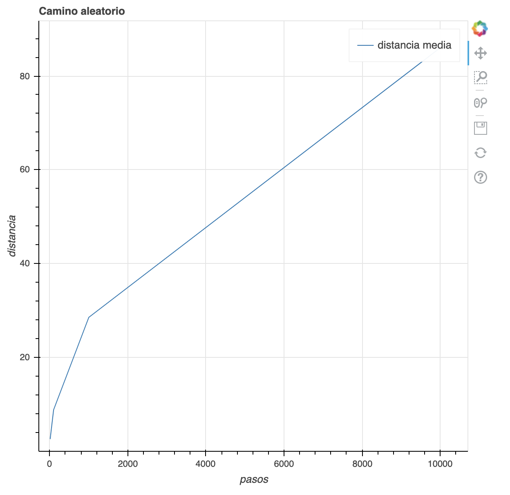
</div>
- ojo el bokeh no va funcionar porque le falta descargar esa libreria:

- 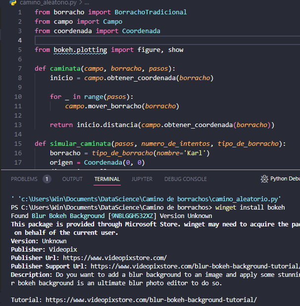