# DataScience

- [ Curso Basico de Python](#BasicoPython)
- [Curso de Fundamentos de Álgebra Lineal con Python](#CursodeFundamentosdeÁlgebraLinealconython)
- [Curso de Estadística Computacional con Python](#CursodeEstadísticaComputacionalconPython)
- [Curso de Python Intermedio: Comprehensions, Lambdas y Manejo de Errores](#CursodePythonIntermedioComprehensionsLambdasyManejodeErrores)
- [Curso Profesional de Python](#CursoProfesionaldePython)
- [Git](#Git)
- [Terminal](#Terminal)
- [Anaconda](#Anaconda)
- [Excel](#Excel)
- [PostgreSQL](#PostgreSQL)
- [SQL Y MYSQL](#SQLYMYSQL)
- [ORACLE DATABASE](#ORACLEDATABASE)
- [LINUX](#LINUX)
- [Pandas](#Pandas)
- [Numpy](#Numpy)
- [DATAWAREHOUSE- ETL - CUBO OLAP - EFESTO](#Datawarehouse)
- [matplotlib](#matplotlib)
- [SeaBorn](#SeaBorn)
- [PowerBi](#PowerBi)
- [mario F triola](#marioFtriola)
- [Algebra](#Algebra)
- [Probabilidad](#Probabilidad)


## BasicoPython
- Python un lenguaje que podemos aprender para iniciarnos en la ingeniería de software. Es utilizado en Drones, Autos autónomos y hasta cohetes, nos rodea por todos lados.

- Razones por iniciarse con Python

  - El lenguaje con mayor crecimiento
  - Es el curso ideal si no tienes ningún contacto con la programación o ya dominas algún lenguaje y quieres aprender más.
  - Su forma de escribir es elegante y simple
  - La programación está en todos lados
  - Programar es darle instrucciones a la computadora para que resuelva un problema.
  - La industria de tecnología es una de las que tienen mayor crecimiento.
- Un algoritmo es una serie de pasos ordenados para resolver un problema. Este es finito, ordenado, y no ambiguo.
- Las características fundamentales que debe cumplir todo algoritmo son:

  - Un algoritmo debe ser preciso e indicar el orden de realización de cada paso.
  - Un algoritmo debe estar definido. Si se sigue un algoritmo dos veces, se debe obtener el mismo resultado cada vez.
  - Un algoritmo debe ser finito. el algoritmo se debe terminar en algún momento; o sea, debe tener un número finito de pasos.
  - Un algoritmo debe ser legible: El texto que lo describe debe ser claro, tal que permita entenderlo y leerlo fácilmente.
- 

### Operaciones Aritmeticos
- Suma: 5 + 5
- Resta: 5 - 5
- Multiplicación: 5 * 5
- División (con decimales): 5 / 5
- División (sin decimales): 21 // 5
- Resto de la división: 21 % 5
- Potencia: 2 ** 2
- Raíz cuadrada:
```py
>>> math.sqrt(9)     
>>> 3.0
>>> math.sqrt(11.11)   
>>> 3.3331666624997918
>>> math.sqrt(Decimal('6.25'))     
>>> 2.5
```
### Que es una variable
- Una variable es un lugar en memoria (una especie de caja) en el que podemos guardar objetos (números, texto, etc). Esta variable posee un identificador o nombre con el cual podemos llamarla más tarde cuando la necesitemos.
- Tipos de variables en Python:
  - a = 28 → int (entero)
  - b = 1.5 → float (decimales)
  - c = “Hello” → str (string o cadena de texto)
  - d = True → boolean (verdadero o falso)
  - e = None → NoneType (Sin valor)
  - f = “5” → str (5 y “5” no son lo mismo. La primera es un entero y la segunda una cadena de texto)
```py
>>> a = 1     
>>> b = 2
>>> c = a + b
>>> print (c)
>>> 
```
- Concatenando se pone entre comillas
```py
>>> a = 'ella'    
>>> b = 'no'
>>> c = 'te ama'
>>> d = a+b+c
>>> print (d)
>>> Ella no te ama
```
### Convertir un dato a un tipo diferente
- int(var) variable a entero
- float(var) variable a flotante
- str(var) variable a texto
- bool(var)variable a booleano
- abs(var) variable a valor absoluto
```py
>>> number1 = int(input("Escribe un numero: "))
Escribe un numero: 100
>>> number2 = int(input("Escribe otro numero: "))
Escribe otro numero: 300
>>> number1 + number2
=> 400
```
- Input("") para pedirle al usuario que introduzca datos.

- int() con datos o variables dentro de parentesis para convertirlo en número entero.

- str() para convertir números tanto decimales como enteros a strings.
### Operadores logicos y de comparacion
- and para comparar si dos valores son verdaderos.
- or para comparar si dos valores son falsos.
- not para invertir el valor booleano.
- == Compara dos valores y te dice si son iguales o no.
- != Compara dos valores y te dice sin son diferentes o no.
- -> Compara si es mayor que otro valor.
- -> Compara si es menor que otro valor.
- >= igual o mayor que el valor a comparar.
- <= igual o menor que el valor a comparar.

## Programa conversor de monedas
```py
def exchanges(moneda,cantidad):
    result = 0
    # Moneda chilena
    if moneda == 1:
        result = cantidad * 0.0013
        print(f'Los {cantidad} pesos chilenos equivalen a {result} dolares')
    # Moneda colombiana
    elif moneda == 2:
        result = cantidad * 0.00027
        print(f'Los {cantidad} pesos colombianos equivalen a {result} dolares')
    # Moneda Argentina
    elif moneda == 3:
        result = cantidad * 0.014
        print(f'Los {cantidad} pesos argentinos equivalen a {result} dolares')
    # Moneda mexicana
    elif moneda == 4:
        result = cantidad * 0.044
        print(f'Los {cantidad} pesos mexicanos equivalen a {result} dolares')
    # Otro
    else:
        print('Ingresa solo un numero de la lista')


if __name__ == '__main__':
    try:
        moneda = int(input('''
        Ingresa el indice de la moneda que quieres convertira  dolar:
            [1] Moneda chilena a Dolar
            [2] Moneda colombiana a Dolar
            [3] Moneda argentida a Dolar
            [4] Moneda mexicana a Dolar
        Selecciona: '''))
        print('********************************')
        cantidad = int(input('Ingresa la cantidad que quieres convertir: '))
        exchanges(moneda,cantidad)
    except:
        print('* * * * * * E R R O R * * * * * *')
        print('Por favor, Ingresa solo valores numericos')
```
### condicionales
- if
(Si) se usa para la condición principal.

- elif
(Si no) en caso de que la condición principal o anterior no se cumpla, se puede utilizar para agregar otra condición.

- else
(Sino) en caso de que la(s) condición(es) anterior(es) no se cumplan, se ejecuta como alternativa sin condicional.
```py
nacionalidad = input("¿Eres peruano? (Responde sí o no) ")
if nacionalidad == "sí":
    cambio_a_soles = 3.9865
    dolares = str(round(float(input("¿Cuántos soles tienes? "))/cambio_a_soles, 2))
    print("Entonces tienes " + dolares + " dólares.")
elif nacionalidad == "no":
    cambio_a_dolares = 0.25298
    soles = str(round(float(input("Bienvenido a Perú. ¿Cuántos dólares tienes? "))/cambio_a_dolares, 2))
    print("Entonces tienes " + soles + " soles.")
else:
    print("Escribe sólo sí o no, por favor. ")

```
```py
numero = input('Escribe un número: ')
numero = float(numero)

if numero > 5:
  print('Es mayor a cinco.')
elif numero == 5:
  print('Es igual a cinco.')
else:
  print('Es menor a cinco.')
  ```
  - convirtiendo con opciones
```py
from tkinter import Menu


Menu = """
Bienvenido al conversor de monedas
1.- Soles peruanos
2.- Pesos argentinos
3.- Pesos colombianos

Choose a option: """

opcion = int(input(Menu))
if opcion == 1:
    soles = input("¿Cuantos soles tienes?:")
    soles = float(soles)
    valor_dolar = 3.875
    dolares = soles/valor_dolar
    dolares = str(dolares)
    print("Tienes:"+dolares+"dolares")
elif opcion == 2:
    pesos = input("¿Cuantos pesos tienes?:")
    pesos = float(pesos)
    valor_dolar = 3.875
    dolares = pesos/valor_dolar
    print("Tienes"+dolares+"dolares")
else:
    print('Ingresa un numero correcto')
  ```
- 

### Aprendiendo a no repetir código con funciones
- Las funciones ayudan a optimizar el código. Es decir, utilizar la menor cantidad de líneas dentro del código y evitar escribir acciones repetitivas.

- Esto nos sirve para entregar un código más limpio y con buenas prácticas, que no desperdicia recursos innecesariamente. En Python, para definir funciones empleamos def.

- Gracias a def, podemos “definir” funciones que emplearemos más tarde. Una función, en programación, es un grupo de instrucciones con un objetivo en particular y que se ejecuta cuando es “invocada”.
```py
def conversacion(opcion):
    print('Hola')
    print('Cómo estás')
    print('Elegiste la opcion: ' + str(opcion))
    print('Adiós')

opcion = int(input('Ingrese una opción (1, 2, 3): '))

if opcion == 1:
    conversacion(opcion)

elif opcion == 2:
    conversacion(opcion)

elif opcion == 3:
    conversacion(opcion)

else:
    print('Escribe una opción correcta.')

```

### funciones
- Una función es un bloque de código que realiza alguna operación. Una función puede definir opcionalmente parámetros de entrada que permiten a los llamadores pasar argumentos a la función. Una función también puede devolver un valor como salida.
```PY
from tkinter import Menu
def conversor(tipo_pesos, valor_dolar):
    pesos = input("cuantos pesos" + tipo_pesos + "tienes?:")
    pesos = float(pesos)
    valor_dolar = 3.384
    dolares = pesos/valor_dolar
    dolares = str(dolares)
    print("Tienes $" + dolares + "dolares")
menu = """
Bienvenido al conversor de monedas
1.- Soles peruanos
2.- Pesos argentinos
3.- Pesos colombianos
Elige una opcion:"""
opcion = int(input(menu))

if opcion == 1:
    conversor("colombianos",3.789)
else:
    print("ELIGE UNA OPCION CORRECTA")
```
### Trabajando con texto: cadenas de caracteres
- Para trabajar con cadenas de texto en Python, vamos a aplicar una serie de métodos a las variables que hayamos creado anteriormente.
Método: es una función especial, que existe para un tipo de dato en particular. Por ejemplo, si queremos que el texto ingresado se transforme en mayúsculas.
- Métodos para trabajar con texto en Python:
  - variable.strip(): El método strip eliminará todos los caracteres vacíos que pueda contener la variable

  - variable.lower(): El método lower convertirá a las letras en minúsculas.

  - variable.upper(): El método upper convertirá a las letras en mayúsculas.

  - variable.capitalize(): El método capitalize convertirá a la primera letra de la cadena de caracteres en mayúscula.

  - variable.replace (‘o’, ‘a’): El método replace remplazará un caracterer por otro. En este caso remplazará todas las ‘o’ por el caracter ‘a’.

  - len(variable): Te indica la longitud de la cadena de texto dentro de la variable en ese momento.
  ```py
  >>> nombre = input ("writte your name: ")
  writte your name: jonathan
  >>> nombre
  'jonathan'
  >>> nombre.upper()
  'JONATHAN'
  >>> nombre.lower()
  'jonathan'
  >>> nombre.strip()
  'jonathan'
  >>> nombre.capitalize()
  'Jonathan'
  ```
### Trabajando con texto: slices
- En Python, los slices, traducidos al español como “rebanadas”, nos permiten dividir los caracteres de un string de múltiples formas. A continuación, realizaremos un ejemplo cómo utilizarlos:
```py
>>> nombre = "Francisco"
>>> nombre
>>> "Francisco"
>>> nombre[0 : 3]
El resultado sería
"Fra"
```
### Bucles
- Un bucle es un ciclo continuo en todos los lenguajes de programación que nos permite iterar sobre nuestros pasos: magina un contador cíclico (1,2,3,4,5,6…) donde puedes agregar un paso más sobre tu programa principal.
- Ejemplo de bucle en la vida real
  - Despertar
  - Estudiar en Platzi
  - Comer
  - Dormir
  ```py
    >>> def potencia(numero):
    
    potencia = 1

    while (potencia <= 10):
        
        result = numero ** potencia
        print('Potencia de {} elevado a la {} es {}'.format(numero, potencia, result))
        potencia += 1
        

    >>>  def run():
    numero = int(input('Escribe el numero al cual quieres averiguarle la potencia: '))
    potencia(numero)


    if __name__ == "__main__":
        run()

  ```
- Nos va salir 10 resultados
### bucle while
- Un bucle while permite repetir la ejecución de un grupo de instrucciones mientras se cumpla una condición (es decir, mientras la condición tenga el valor True).

- La sintaxis del bucle while es la siguiente:

  ```py
    def run():
    LIMITE = 1000000
    contador = 0
    potencia_2 = 2**contador
    while potencia_2 < LIMITE:
        print('2 elevado a ' + str(contador) +
              ' es igual a: ' + str(potencia_2))
        contador = contador + 1
        potencia_2 = 2**contador

    if __name__ == "__main__":
        run()

    ```

    ```py
        contador = 1
        print(contador)
        while contador < 1000:
            contador = contador + 1
            print(contador)
    ```
- cuenta del 1 a 1000
### for
- El ciclo for es un tipo de bucle usado cuando se conozcan la cantidad de veces a iterar.

- Un contador es una variable que se encarga de contener valores que irán incrementando o decrementando cada vez que se ejecuta una acción que lo contenga. El incremento o decremento es llamado paso del contador y es siempre constante.

- Ejemplo: El marcador de un partido de fútbol, cada vez que un equipo anote un gol, aumenta su marcador en una unidad.
- Su sintaxis es:
  - variable = variable + constante(al incrementar)
  - variable = variable - constante(al decrementar)

- o de manera resumida:

  - variable += constante
  - variable -= constante
    ```py
    for i in range(10):
        print(i)
    ```
### Proyecto final generador de contraseñas
```py
    import random
import string

def generate_password():
    # capitalize = ['A','B','C','D','E','F','G','H','I','J','K','L','M','N','O','P','Q','R','S','T','Y','X','Y','Z']
    # lowercase = [letter.lower() for letter in capitalize] 
    # symbols = ['?','¡','¿','%','&','$','#','/','!','+','[']
    # numbers = ['1','2','3','4','5','6','7','8','9','10']

    # characters = capitalize + lowercase + symbols + numbers

    characters = string.ascii_lowercase + string.ascii_uppercase + string.digits + string.punctuation

    password = []

    for i in range(15):
        character_random = random.choice(characters)
        password.append(character_random)

    password = "".join(password)

    return password


def run ():
    password = generate_password()
    print('Your new password is: ' + password)

if __name__ == '__main__':
    run()
```
## CursodeFundamentosdeÁlgebraLinealconython
- El álgebra lineal es una rama de las matemáticas que estudia conceptos tales como vectores, matrices, espacio dual, sistemas de ecuaciones lineales y en su enfoque de manera más formal, espacios vectoriales y sus transformaciones lineales.
- Por qué Python para Data Science:
  - Si ya conoces el lenguaje Python no hace falta que te cuente porque es el elegido en la industria para dar vida a los proyectos de Data Science. Pero si no estás familiarizado con Python estas son algunas de sus características:

   - Es poderoso y sencillo
   - Tiene múltiples paquetes estadísticos y de aprendizaje automático, listos para usar
   - Una comunidad muy activa a la que siempre puedes consultar
- Por qué Anaconda:
  - Anaconda nos provee de una plataforma muy completa para poder desarrollar nuestros proyectos de Data Science, simplifica la tarea de instalación y configuración de las distintas aplicaciones que necesitaremos usar en nuestro viaje. Podemos utilizarlo tanto por terminal como por interfaz gráfica (GUI). Por el momento avancemos con la segunda opción, es más amigable para quien no está acostumbrado a la línea de comandos.
  - Instalacion:
  - Ir a https://www.anaconda.com/distribution/
  - Selecciona tu versión de Sistema Operativo: Windows - macOS - Linux
  - Haz click en Descargar/Download “Python 3.7 version” (o click en la versión adecuada para tu CPU 64-bit o 32-bit)
- Iniciando Anaconda
Una vez que finalizada la instalación debes abrir el programa Anaconda Navigator para que podamos crear el entorno en cual estaremos estudiando y actualizar los paquetes.

- Haz click en Environments y despues click en +Create. Se abrirá una ventana para crear un nuevo entorno.
- 
- Llena los siguientes campos:
- 
- Name: jacob - FundamentosAL
- Packages: tilde en Python y del menú desplegable selecciona 3.7
- 
- momento para configurar el nuevo entorno y actualizarlo. Cuando termine verás una pantalla similar a esta
- 
- Los paquetes que ves son los que están instalados por defecto, necesitas instalar varios más. Haz click en installed y cambiarlo a not installed.
- 
- En el recuadro de search packages pon:

   - Jupyter Notebook
   - scipy (tambien instalará numpy)
   - pillow (libreria para manejo de imágenes)
   - imageio (lectura / escritura de imágenes)
   - matplotlib (para graficar)
   - seaborn (visualizaciones estadísticas)
   - scikit-learn (aprendizaje automático - lo usaremos para un ejemplo de PCA)
- Una vez finalizada la instalacion y actualizacion de paquetes en el entorno Platzi - FundamentosAL hacemos click en Home, y Launch Jupyter Notebook. Una nueva pestaña se abrirá en nuestro navegador con Jupyter, ya estamos listos para comenzar el aprendizaje de Fundamentos de Álgebra Lineal con Python.
- EJERCICIO
 - Instala el paquete seaborn. Es un paquete para visualizar datos.
   - 1 - Desde Anaconda Navigator, haz click en Environments
   - 2 - Selecciona el entorno donde quieres instalar el paquete (Jacob - FundamentosAL)
   - 3 - Selecciona en el menú desplegable Not Installed
   - 4 - Escribe en el recuadro de búsqueda seaborn
   - 5 - Haz click en el paquete seaborn
   - 6 - Haz click en Apply
   - 7 - Haz click en Apply, pero esta vez en el pop up que aparece para aceptar todas las dependencias.
- copia el siguiente codigo:
    ```js
        import seaborn as sns
        vuelos = sns.load_dataset("flights")
        vuelos = vuelos.pivot("month", "year", "passengers")
        ax = sns.heatmap(vuelos)
    ```
- A los que no les aparezcan los paquetes en “Not Installed”, sólo tienen que darle a “Update index…”.
- Para ejecutar el código de arriba deben instalar Jupyter Lab, se van a home ejecutan Launch de Jupyter Lab, seleccionan Python 3 y pegan el código esperan un momento y les aparecerá el gráfico.
- 
- primero codigos:
    ```py
    print ('hello world')


    from platform import python_version
    print(python_version())

    ```
- comentamos con #
- ejecutar notebooks dentro de otros: %run "archivo_funciones.ipynb"

### Creando las bases, escalares, vectores y matrices. ¿Qué es un tensor? ¿Cómo se representa?
- Escalar = numero
- Vector = un lugar donde se colocan muchos numeros
- Matrices = muchos vectores apilados - filas y comulnas
- Tensor = muchas matrices se mueve entre filas y columnas entre matrices

- import numpy as np
    - numpy significa numerical python
- 
- interpolacion la union de espacios en un punto
- 
- 
- shape : nos indica de cuanto es la matriz 3*3
- size : nos da el tamaño total de la matriz 9
- len: nos dice cuantos elementos hay en la primera columna
- 

### transponer
- Transponer: es cambiar filas por columnas
- 
### Suma de matrices
- 
- se suma cada x y y y se le pone en la nueva matriz
- ojo: la matrices deben tener la misma dimecion es decir si es de : 2x2 y la otra matriz de 2x2 si se podra realizar la operacion igual de 3x3 y sucesivamente
 - 

 ### Producto interno entre una matriz y un vector
- multiplicar una matriz por un vector:
 - 
- producto interno:
 - 

### Propiedades de las matrices: la multiplicación de matrices es asociativa y distributiva, no es conmutativa
- 
- 

### Cómo comprobar la solución de un sistema de ecuaciones lineal
- En esta clase aprenderemos cómo plantear un sistema de ecuaciones de forma matricial y realizar el proceso para comprobar su solución. Al final nos preguntaremos si existe una operación o elemento para realizar la **división **entre matrices para obtener la solución de un sistema de ecuaciones.
- ACLARACION: Al final de la clase el profesor hace un despeje dudoso ya que se esta trabajando con matrices, como tenemos Ax = b = (Matriz 2x2)(Matriz 2x1) = (Matriz 2x1). Lo correcto para despejar la matriz (o vector) x seria multiplicar por la izquierda la inversa de A y por tanto nos quedaria como: x = A_inv * b
- 
- 
- calculo manual:
- 

###  sistemas sin solución, con una solución y con infinitas
- 
### Grafica de vectores
-  un vector​ es un ente matemático como la recta o el plano. Un vector se representa mediante un segmento de recta, orientado dentro del espacio euclidiano tridimensional. El vector tiene 3 elementos: módulo, dirección y sentido.​
```py
    %matplotlib inline

    import numpy as np
    import matplotlib.pyplot as plt

    v1 = np.array([2,5])
    v2 = np.array([3,2])

    # vecs: vectores.
    # cols: colores.
    # alpha: valor de transparencia.
    def graficarVectores(vecs, cols, alpha=1):
        plt.figure()
        plt.axvline(x=0, color="grey", zorder=0)
        plt.axhline(y=0, color="grey", zorder=0)
        
        for i in range(len(vecs)):
            # El origen de los vectores inicia en el punto (0,0)
            x = np.concatenate([[0,0], vecs[i]])
            plt.quiver([x[0]],
                    [x[1]],
                    [x[2]],
                    [x[3]],
                    angles='xy', scale_units='xy', scale=1, 
                    color=cols[i], alpha=alpha)

    graficarVectores([v1,v2], ['orange', 'blue'])
    # Definimos los limites
    plt.xlim(-1, 8)
    plt.ylim(-1, 8)
```
- 

## CursodeEstadísticaComputacionalconPython
- Programacion dinamica:
  - La programación dinámica es la optimización de un algoritmo mediante el desarrollo de subsistemas que van a reducir su tiempo de ejecución.
- fibonacci dinamico:
  ```py
    
    def fibonacci_dinamico(n, memo = {}):
        if n == 0 or n == 1:
            return 1

        try:
            return memo[n]
        except KeyError:
            resultado = fibonacci_dinamico(n-1)+fibonacci_dinamico(n-2)
            memo[n] = resultado
            return resultado
    if __name__ == '__main__':
        n = int(input('Escoge un numero: '))
        resultado = fibonacci_dinamico(n)
        print(resultado)

   ```
### caminos aleatorios
- Es un tipo de desicion que elige aleatoriamente una decision dentro de un conjunto de decisiones validas.
- Lugares dónde utilizaría los caminos aleatorios:
   - clima
   - valor de los pasajes aereos
   - inflación
   - valor del bitcoin
   - reacción del público ante un nuevo producto
   - Algunas aplicaciones:
   - Arribo de clientes a un banco / Peticiones de Clientes a un Servidor 
   - Tiempo de atención de un reclamo 
   - Teoría de Colas 
   - Simulación de Sistemas.
   - Ofertas en Subastas.
   - Cantidad de Defectos por Artículo Producido
   - Distribución Poisson 
   - Control de Calidad
   - Auditoria de expedientes 
   - Muestra sin Reposición.
   - Cálculo de Area para curvas no Diferenciales.
   - Ruta crítica de un proyecto, escenario de pésimo, moderado y optimista de tareas 
   - Distribución Triangular, por ejemplo.
   - Diseño de Experimentos 
   - Factores aleatorios
   - Machine Learning.
   - Video Juegos, juegos de apuestas virtuales.
### Entendiendo la aleatoriedad con Python
- caso de borrachos
  - Un borracho
  - Donde se mueve el borracho
  - Coordenadas
- Si lo queremos ver en términos de programación orientada a objetos; nos podemos imaginar al borracho cómo alguien que se mueve, el campo como si fuera un mapa y la coordenada como un pointer adentro de este mapa.
- Otra cosa bien interesante es que dentro de la programación orientada a objetos es que nosotros podemos generar una jerarquía, y la jerarquía básicamente es como nosotros  podemos expandir cosas generales que hereden de un padre.
- 
- En ese código se usó el enfoque de POO 💩.
- Se tienen 3 clases: borracho, campo y coordenada. Una subclase de borracho es borracho tradicional, el cual se puede mover aleatoriamente hacia arriba, derecha, izquierda y abajo con igual probabilidad.
- Dado que inicia en $(0, 0)$, nos interesa conocer donde está después de $n$ pasos. Al final, para ver donde termino, podemos usar la distancia euclidiana. .- Dado que es aleatorio, no se aleja tanto del centro.
- Si corremos solo la simulación una vez para cada $n$, no podríamos conocer el promedio y el comportamiento general, debemos correrlo varias veces (como si lanzáramos un dado). En el ejemplo lo hacemos 100 veces (intentos).
- En general, en cada simulación, podemos esperar resultados diferentes, pero el promedio será siempre el mismo.
Este es un ejercicio donde empezando desde un punto 0 **aleatoriamente** podemos decidir que dirección tomar, dependiendo de las opciones establecidas.

<div align="center"> 
  
</div>

Para realizar un ejemplo de aleatoriedad vamos a crear un programa que representara el problema del "Camino de Borrachos". Para esto crearemos 3 clases: uno que represente al **agente que camina**, una que genere una **abstracción de las coordenadas** y una que represente el **plano** en el cual nos estamos moviendo, y vamos a graficar la distancia en la que termina nuestro agente a medida que definimos una mayor cantidad de pasos que puede dar. 

Primero crearemos un ambiente virtual, para ello vamos a la terminar.

```bash
mkdir camino_de_borramos    # Creamos una carpeta para nuestro proyecto.
cd camino_de_borrachos      # Ingresamos a la carpeta.
python3 -m venv env         # Creamos nuestro ambiente virtual.
source env/bin/activate     # Activamos nuestro ambiente.
pip install bokeh           # Instalamos el paquete de bokeh para generar nuestra gráfica.
```

Luego de haber creado nuestro entorno de trabajo creamos los siguientes archivos en nuestra carpeta.

```py
# Creamos un archivo borracho.py
import random

# Creamos nuestra Clase borracho.
class Borracho:

    def __init__(self, nombre):
        self.nombre = nombre


# Creamos la clase BorrachoTradicional que extiende de Borracho.
class BorrachoTradicional(Borracho):

    def __init__(self, nombre):
        super().__init__(nombre)

    # Y tendrá un método caminar que devolverá la dirección a la que ira.
    def camina(self):
        # Con random.choice elegimos un elemento aleatoriamente de la lista.
        return random.choice([(0, 1), (0, -1), (1, 0), (-1, 0)])
```

```py
# Creamos un archivo coordenada.py

# La clase Coordenada guardara las coordenadas de nuestro agente
class Coordenada:

    # Definimos unas posiciones iniciales.
    def __init__(self, x, y):
        self.x = x
        self.y = y

    # Y cuando se mueve simplemente a las coordenadas actuales se les
    # suma las coordenadas X e Y que ingresan como parámetros.
    def mover(self, delta_x, delta_y):
        return Coordenada(self.x + delta_x, self.y + delta_y)


    # Y si queremos saber la distancia del agente con respecto a
    # unas coordenadas, simplemente lo calculamos con el
    # teorema de Pitágoras.
    def distancia(self, otra_coordenada):
        delta_x = self.x - otra_coordenada.x 
        delta_y = self.y - otra_coordenada.y 

        return (delta_x**2 + delta_y**2)**0.5
```

```py
# Creamos un archivo campo.py
class Campo:

    # Nuestra clase tendrá como atributo un diccionario.
    def __init__(self):
        self.coordenadas_de_borrachos = {}


    # Añadimos un agente a nuestro diccionario, nuestra llave sera
    # nuestro parámetro "borracho" y tendrá el valor asignado "coordenada"
    # que es una clase Coordenada creado en coordenada.py.
    def anadir_borracho(self, borracho, coordenada):
        self.coordenadas_de_borrachos[borracho] = coordenada


    def mover_borracho(self, borracho):
        # Al mover a nuestro agente ejecutamos el método camina de
        # nuestra clase BorrachoTradicional creado en el archivo borracho.py,
        # devolviendo la dirección hacia donde se movió.
        delta_x, delta_y = borracho.camina()

        # Obtenemos el objeto de Coordenada.
        coordenada_actual = self.coordenadas_de_borrachos[borracho]

        # Del objeto Coordenada ejecutamos el método mover con los parámetros
        # que el objeto borracho genero. El resultado lo guardamos en
        # nueva_coordenada.
        nueva_coordenada = coordenada_actual.mover(delta_x, delta_y)

        # El objeto guardado en nueva_coordenada ahora estará asociado
        # a la llave de borracho.
        self.coordenadas_de_borrachos[borracho] = nueva_coordenada


    def obtener_coordenada(self, borracho):
        return self.coordenadas_de_borrachos[borracho]
```

```py
# Creamos el archivo camino_aleatorio.py

# Importamos las clases que creamos anteriormente.
from borracho import BorrachoTradicional
from campo import Campo
from coordenada import Coordenada

# Importamos bokeh para generar un gráfico con nuestros resultados.
from bokeh.plotting import figure, show


def caminata(campo, borracho, pasos):
    # De la instancia Campo obtenemos las coordenadas actuales de la llave "borracho".
    inicio = campo.obtener_coordenada(borracho)

    # Repetiremos la misma cantidad de pasos definidos.
    for _ in range(pasos):

        # De la instancia campo ejecutaremos mover_borracho.
        campo.mover_borracho(borracho)

    # Y devolveremos la distancia entre las coordenadas de la instancia
    # inicio y campo.
    return inicio.distancia(campo.obtener_coordenada(borracho))


def simular_caminata(pasos, numero_de_intentos, tipo_de_borracho):

    # Definimos los parámetros para crear una instancia de Campo.
    borracho = tipo_de_borracho(nombre='Karl')
    origen = Coordenada(0, 0)

    # Creamos una lista que guardara las distancias en cada simulación.
    distancias = []

    # Por cada numero de intento.
    for _ in range(numero_de_intentos):

        # Creamos una instancia de Campo.
        campo = Campo()

        # A nuestra instancia de Campo le damos la llave borracho y sus coordenadas de origen.
        campo.anadir_borracho(borracho, origen)

        # Obtenemos la distancia final de la simulación.
        simulacion_caminata = caminata(campo, borracho, pasos)

        # El resultado lo guardamos en la lista de distancias.
        distancias.append(round(simulacion_caminata, 1))
    
    # Retornamos la lista de distancias.
    return distancias


def graficar(x, y):
    # Creamos una instancia de figure, con su titulo y las etiquetas de los ejes.
    grafica = figure(title='Camino aleatorio', x_axis_label='pasos', y_axis_label='distancia')

    # Ingresamos los datos de X e Y.
    grafica.line(x, y, legend='distancia media')

    # Generamos una gráfica en HTML.
    show(grafica)


def main(distancias_de_caminata, numero_de_intentos, tipo_de_borracho):

    # Creamos una lista que guardara el promedio de cada caminata.
    distancias_media_por_caminata = []

    # Por cada ítem en nuestras series de caminata.
    for pasos in distancias_de_caminata:

        # Guardamos las distancias que generan todas las simulaciones definido en numero_de_intentos.
        distancias = simular_caminata(pasos, numero_de_intentos, tipo_de_borracho)

        # De la lista de distancias obtenemos la distancia promedio.
        distancia_media = round(sum(distancias) / len(distancias), 4)

        # De la lista de distancias obtenemos el máximo valor.
        distancia_maxima = max(distancias)

        # De la lista de distancias obtenemos el menor valor.
        distancia_minima = min(distancias)

        # Guardamos el promedio de la caminata en la lista distancias_media_por_caminata.
        distancias_media_por_caminata.append(distancia_media)

        # Imprimimos los datos de la caminata actual.
        print(f'{tipo_de_borracho.__name__} caminata aleatoria de {pasos} pasos')
        print(f'Media = {distancia_media}')
        print(f'Max = {distancia_maxima}')
        print(f'Min = {distancia_minima}')

    # Generamos un gráfico con la información de las distancias finales según la cantidad de pasos.
    graficar(distancias_de_caminata, distancias_media_por_caminata)

if __name__ == '__main__':
    # Definamos cuantos pasos queremos que camine en cada serie.
    distancias_de_caminata = [10, 100, 1000, 10000]
    
    # Determinamos la cantidad de simulaciones que generara en cada serie.
    numero_de_intentos = 100

    # Ejecutamos el método main con los parámetros definidos anteriormente
    # y además pasamos la clase BorrachoTradicional
    main(distancias_de_caminata, numero_de_intentos, BorrachoTradicional)
```

Dentro el pensamiento **estocástico** debemos realizar varias simulaciones, por ese motivo en el ejemplo anterior realizamos varios intentos. Lo importante de esta aleatoriedad es que podemos distribuirla a lo largo de varios intentos, con esto podemos obtener certeza de que el comportamiento de nuestro programa se comporte en que esperamos estadísticamente.

Para ejecutar nuestro programa iremos nuevamente a la consola.

```bash
python3 camino_aleatorio.py     # Ejecutamos nuestro programa

# Y veremos nuestros resultados:

BorrachoTradicional caminata aleatoria de 10 pasos
Media = 2.639
Max = 6.3
Min = 0.0
BorrachoTradicional caminata aleatoria de 100 pasos
Media = 8.914
Max = 23.5
Min = 1.4
BorrachoTradicional caminata aleatoria de 1000 pasos
Media = 28.58
Max = 73.8
Min = 2.0
BorrachoTradicional caminata aleatoria de 10000 pasos
Media = 86.012
Max = 241.3
Min = 22.4
```

Y nuestra gráfica en HTML se vera así.

<div align="center"> 
  
</div>
- ojo el bokeh no va funcionar porque le falta descargar esa libreria:

- 

### Programación Estocástica
- Deterministica: Calcular las personas infectadas por Covid según las pruebas realizadas el día de hoy.
- Estocastica: Calcular cual serán las personas infectadas en los próximos días según el indicador RO.
- EJEMPLO:
  - Determinista:
    - Un programa de ventas de tickets, donde las entradas que de el usuario, deben dar salidas preestablecidas

  - Estocástico:
    - Un programa de simulación de divisas para trading, utilizando datos históricos para tomar decisiones según probabilidad de escenarios.
### Probabilidad
- La probabilidad es una medida de la certidumbre asociada a un evento  suceso futuro y sule expresarse como un numero entre 0 y 1.
- La probabilidad de 0 significa que nunca sucedera
- La probalidad de 1 significa que un suceso esta garantizado de suceder en el futuro.
- 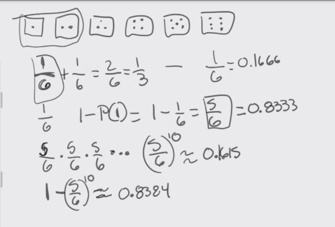
```py
    import random

    def tirar_dado(numero_de_tiros):
        secuencia_de_tiros = []

        for _ in range(numero_de_tiros):
            tiro = random.choice([1, 2, 3, 4, 5, 6])
            secuencia_de_tiros.append(tiro)

        return secuencia_de_tiros

    def main(numero_de_tiros, numero_de_intentos):
        tiros = []
        for _ in range(numero_de_intentos):
            secuencia_de_tiros = tirar_dado(numero_de_tiros)
            tiros.append(secuencia_de_tiros)

        tiros_con_1 = 0
        for tiro in tiros:
            if 1 not in tiro:
                tiros_con_1 += 1

        probabilidad_tiros_con_1 = tiros_con_1 / numero_de_intentos
        print(f'Probabilidad de no obtener por lo menos un 1 en {numero_de_tiros} tiros = {probabilidad_tiros_con_1}')


    if __name__ == '__main__':
        numero_de_tiros = int(input('Cuantas tiros del dado: '))
        numero_de_intentos = int(input('Cuantas veces correra la simulacion: '))

        main(numero_de_tiros, numero_de_intentos)
```
### ejemplo en colab

```py
    #prob.py
    ###########################################
    import random
    #for plotting
    from bokeh.plotting import figure, show
    #Show plot in notebook
    from bokeh.io import output_notebook
    output_notebook()

    #throw dice
    def throw_dice(n_shots):
        shot_secuence = []
        for _ in range(n_shots):
            shot = random.choice([1,2,3,4,5,6])
            shot_secuence.append(shot)
        return shot_secuence

    #
    def plot(sim, prob):
        plot = figure(title='Probability get 1 with 1 shot',
                    x_axis_label='Attempts',
                    y_axis_label='Probability')
        
        plot.line(sim,prob)
        show(plot)

    #Calculus of probability 
    def calc_prob(shots, n_simulation):
        shot_1 = 0
        for shot in shots:
            if 1 in shot:
                shot_1 += 1
        return shot_1 / n_simulation

    #Main
    def main(n_shots, n_simulation):
        prob=[]
        sim=[]
        for n in range(1,n_simulation,100):
            shots=[]
            for _ in range(n):
                shots_secuence = throw_dice(n_shots)
                shots.append(shots_secuence)
    
            prob_shot_1 = calc_prob(shots, n)
            #Append values
            prob.append(prob_shot_1)
            sim.append(n)

        #prob_shot_1 = calc_prob(shots, n_simulation)
        #print(f'Prob to get 1:  {prob_shot_1}')

        #plot
        plot(sim, prob)
        

    #if __name__ == "__main__":
    #Inputs
    n_shots = int(input('Try shots:'))
    n_simulation = int(input('Simulation number:'))

    #Call main
    main(n_shots, n_simulation)
```
### Inferencia estadistica
- la muestra si o si debe ser aleatoria
- 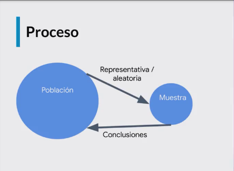

Con las simulaciones podemos calcular las probabilidades de eventos complejos sabiendo las probabilidades de eventos simples.

¿Que pasa cuando no sabemos las probabilidades de los eventos simples? Las técnicas de la **inferencia estadística** nos permiten inferir/concluir las propiedades de una población a partir de una muestra **aleatoria.**

_"El principio guía de la **inferencia estadística** es que una muestra aleatoria tiende a exhibir las mismas propiedades que la población de la cual fue extraída."_ - John Guttag

<div align="center"> 
  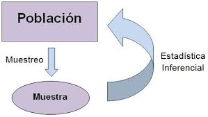
</div>

### Ley de los grandes números

Con la **ley de los grandes números** podemos ver que en pruebas independientes repetidas con la misma probabilidad p de un resultado, la fracción de desviaciones de p converge a cero conforme la cantidad de pruebas se acerca al infinito.

<div align="center"> 
  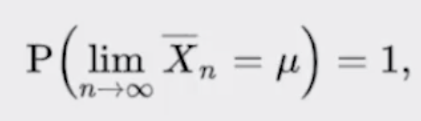
</div>

### Falacia del apostador

La **falacia del apostador** señala que después de un evento extremo, ocurrirán eventos menos extremos para nivelar la media.

La _regresion a la media_ señala que después de un evento aleatorio extremo, el siguiente evento probablemente será menos extremo.

## Media

La **media** es una medida de tendencia central, comúnmente conocido como promedio. La media de una población se denota con el símbolo μ y la media de una muestra se define con X̄.

<div align="center"> 
  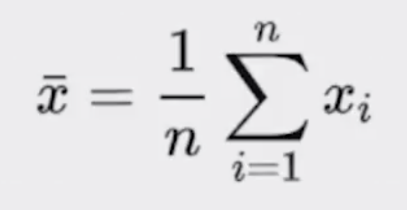
</div>

Una forma de calcular la media con Python seria la siguiente.

```py
import random

def media(X):
    return sum(X) / len(X)

if __name__ == '__main__':
    X = [random.randint(9, 12) for i in range(20)]
    mu = media(X)

    print(f'Arreglo X: {X}')
    print(f'Media = {mu}')
```

## Varianza y Desviación Estándar

### Varianza

La **varianza** mide qué tan propagados se encuentran un conjunto de valores aleatorios de su media. Mientras que la **media** nos da una idea de dónde se encuentran los valores, la **varianza** nos dice que tan dispersos se encuentran. La **varianza** siempre debe entenderse con respecto a la media.

<div align="center"> 
  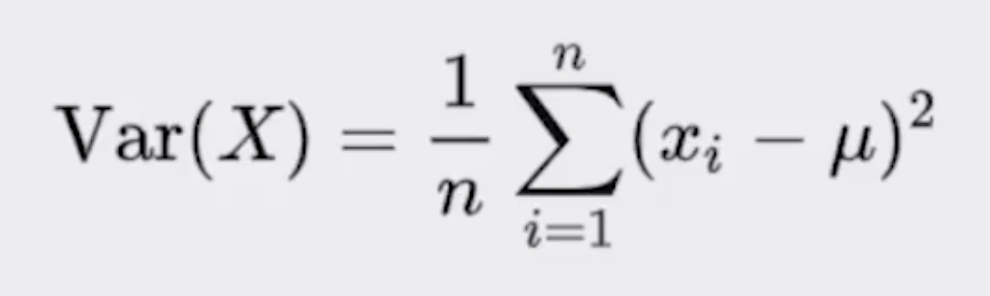
</div>

### Desviación estándar

La **desviación estándar** es la raíz cuadrada de la **varianza**. Nos permite entender, también, la propagación y se debe entender siempre relacionado con la **media**.

La ventaja sobre la **varianza** es que la desviación estándar está en las mismas unidades que la **media**.

<div align="center"> 
  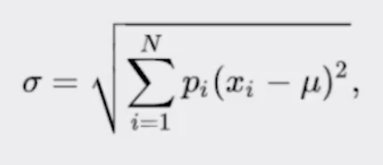
</div>

Vamos a implementar las funciones de **varianza** y **desviación estándar** en nuestro script ya hecho para la **media.**

```py
import random
import math

def media(X):
    return sum(X) / len(X)


def varianza(X):
    mu = media(X)

    acumulador = 0
    for x in X:
        acumulador += (x - mu)**2

    return acumulador / len(X)


def desviacion_estandar(X):
    return math.sqrt(varianza(X))


if __name__ == '__main__':
    X = [random.randint(9, 12) for i in range(20)]
    mu = media(X)
    Var = varianza(X)
    sigma = desviacion_estandar(X)

    print(f'Arreglo X: {X}')
    print(f'Media = {mu}')
    print(f'Varianza = {Var}')
    print(f'Desviacion estandar = {sigma}')
```

## Distribución Normal

La **distribución normal** es una de las distribuciones mas recurrentes en cualquier ámbito. Se define completamente por su **media** y su **desviación estándar**. Permite calcular **intervalos de confianza** con la regla empírica.

<div align="center"> 
  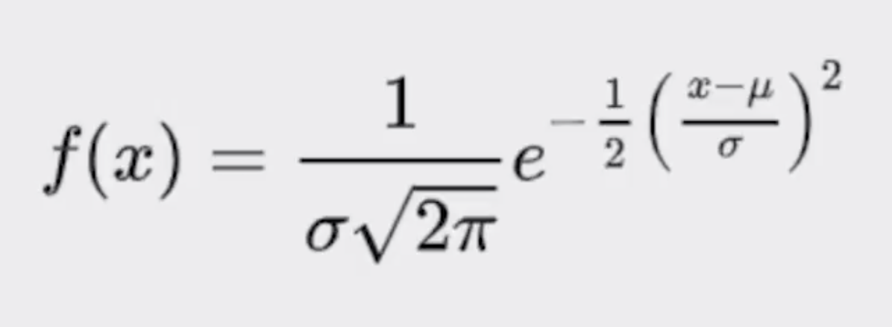
</div>

En el siguiente ejemplo vamos una unas distribuciones con desviación estándar 1 y 3. Cuando la desviación es baja significa la variabilidad de los datos es menor.

<div align="center"> 
  
</div>

### Regla empírica

También conocida como la regla 68-95-99.7. Señala cuál es la dispersión de los datos en una distribución normal a uno, dos y tres sigmas.

Permite calcular probabilidades con la densidad de la distribución normal.

<div align="center"> 
  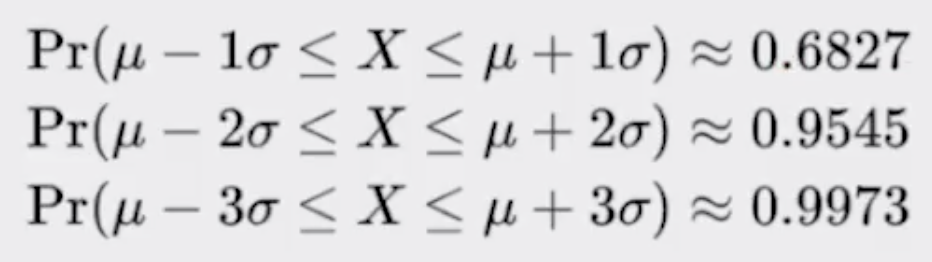
</div>

<div align="center"> 
  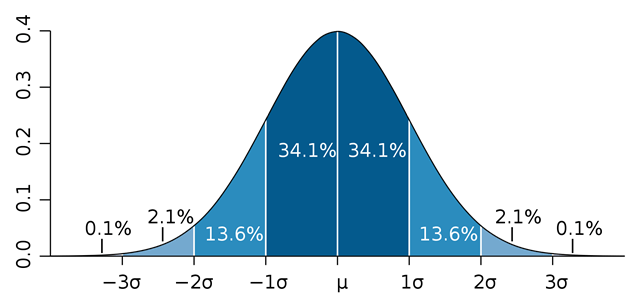
</div>

# Simulaciones de Montecarlo

## ¿Qué son las Simulaciones de Montecarlo?

Permite crear simulaciones para predecir el resultado de un problema, además de convertir problemas determinísticos en problemas estocásticos.

Es utilizado en gran diversidad de áreas, desde la ingeniería hasta la biología y el derecho.

## Simulación de Barajas

```py
import random
import collections

PALOS = ['espada', 'corazon', 'rombo', 'trebol']
VALORES = ['as', '2', '3', '4', '5', '6', '7', '8', '9', '10', 'jota', 'reina', 'rey']

def crear_baraja():
    barajas = []
    for palo in PALOS:
        for valor in VALORES:
            barajas.append((palo, valor))

    return barajas

def obtener_mano(barajas, tamano_mano):
    mano = random.sample(barajas, tamano_mano)
    
    return mano

def main(tamano_mano, intentos):
    barajas = crear_baraja()

    manos = []
    for _ in range(intentos):
        mano = obtener_mano(barajas, tamano_mano)
        manos.append(mano)

    pares = 0
    for mano in manos:
        valores = []
        for carta in mano:
            valores.append(carta[1])

        counter = dict(collections.Counter(valores))
        for val in counter.values():
            if val == 3:
                pares += 1
                break

    probabilidad_par = pares / intentos
    print(f'La probabilidad de obtener un par en una mano de {tamano_mano} barajas es {probabilidad_par}')


if __name__ == '__main__':
    tamano_mano = int(input('De cuantas barajas sera la mano: '))
    intentos = int(input('Cuantos intentos para calcular la probabilidad: '))

    main(tamano_mano, intentos)
```

## Cálculo de PI

Calcularemos PI con puntos al azar esparcidos en un plano cartesiano utilizando los scripts de **desviación estándar** y **media** que creados anteriormente. Queremos tener un **95% de certeza**, entonces para ello realizaremos el cálculo para 1/2 del área de un circulo, optimizando nuestros recursos.

```py
import random
import math
from estadisticas import desviacion_estandar, media

def aventar_agujas(numero_de_agujas):
    adentro_del_circulo = 0

    for _ in range(numero_de_agujas):
        x = random.random() * random.choice([-1, 1])
        y = random.random() * random.choice([-1, 1])
        distancia_desde_el_centro = math.sqrt(x**2 + y**2)

        if distancia_desde_el_centro <= 1:
            adentro_del_circulo += 1

    # La variable adentro_del_circulo representa 1/4 del área del círculo,
    # y como solo utilizaremos 1/2 vamos a multiplicarlo por 2.
    return (2 * adentro_del_circulo) / numero_de_agujas


def estimacion(numero_de_agujas, numero_de_intentos):
    estimados = []
    for _ in range(numero_de_intentos):
        estimacion_pi = aventar_agujas(numero_de_agujas)
        estimados.append(estimacion_pi)

    media_estimados = media(estimados)
    sigma = desviacion_estandar(estimados)

    # La variable media_estimados tiene los resultados sobre 1/2 del área del
    # círculo. Para obtener la estimación de PI completo lo vamos a multiplicar por 2.
    print(f'Est={round(media_estimados, 5) * 2}, sigma={round(sigma, 5)}, agujas={numero_de_agujas}')

    return (media_estimados, sigma)

def estimar_pi(precision, numero_de_intentos):
    numero_de_agujas = 1000
    sigma = precision

    while sigma >= precision / 1.96:
        media, sigma = estimacion(numero_de_agujas, numero_de_intentos)
        numero_de_agujas *= 2

    return media

if __name__ == '__main__':
    estimar_pi(0.01, 1000)
```

Vamos a la consola y ejecutamos nuestro programa.

```bash
python3 calculo_pi.py   # Ejecutamos nuestro script.

# Y estos serán nuestros resultados.
Est=3.14234, sigma=0.02594, agujas=1000
Est=3.13966, sigma=0.01795, agujas=2000
Est=3.143, sigma=0.01272, agujas=4000
Est=3.14076, sigma=0.00949, agujas=8000
Est=3.14142, sigma=0.00678, agujas=16000
Est=3.14154, sigma=0.00457, agujas=32000
```

# Muestreo e Intervalos de Confianza

## Muestreo

El **muestreo** es muy importante cuando no tenemos acceso a toda la población que queremos explorar. Uno de los grandes descubrimientos de la estadística es que las **muestras aleatorias** tienden a mostrar las mismas propiedades de la población objetivo. Hasta este punto todos los **muestreos** que hemos hecho son de tipo **probabilísticos**.

En un **muestreo aleatorio** cualquier miembro de la población tiene la misma probabilidad de ser escogido.

En un **muestreo estratificado** tomamos en consideración las características de la población para partirla en subgrupos y luego tomamos muestras de cada subgrupo, esto incrementa la probabilidad de que el muestreo sea representativo de la población.

## Teorema del Límite Central

El **teorema del límite central** es uno de los teoremas más importantes de la estadística. Establece que **muestras aleatorias** de cualquier distribución van a tener una **distribución normal**. Esto permite entender cualquier distribución como la **distribución normal de sus medias** y eso nos permite aplicar todo lo que sabemos de **distribuciones normales.**

Mientras más muestras obtengamos, mayor será la similitud con la distribución normal. Mientras la muestra sea de mayor tamaño, la desviación estándar será menor.

<div align="center"> 
  
</div>

# Datos Experimentales

## ¿Cómo trabajar con datos experimentales?

Los **datos experimentales** son aquellos que se generan a través del **método científico**.

- Con el **método científico** es necesario comenzar con una _teoría_ o _hipótesis_ sobre el resultado al que se quiere llegar. 
- Basado en la _hipótesis_ se debe crear un experimento para **validad** o **falsear** la _hipótesis_.
- Se **valida** o **falsea** una _hipótesis_ midiendo la diferencia entre las mediciones experimentales y aquellas mediciones predichas por la _hipótesis_.

## Regresión Lineal

La **regresión lineal** nos permite aproximar una función a un conjunto de datos obtenidos de manera experimental. No necesariamente permite aproximar funciones lineales, sino que sus variantes permiten aproximar cualquier **función polinómica.**

Para ver un ejemplo de regresiones lineales en _Python_ en el siguiente enlace puedes acceder a ver un ejemplo: [Collab - Regresión Lineal.](https://colab.research.google.com/drive/1c0Lx0xQyxuoZsnVKZzMFcANykA5VWN5F)


## CursodePythonIntermedioComprehensionsLambdasyManejodeErrores

### El Zen de Python
- El Zen de python son los principios de este lenguaje lo que quiere es escribir tu código de manera clara, sencilla y precisa.

  -  Bello es mejor que feo.
  -  Explícito es mejor que implícito.
  -  Simple es mejor que complejo.
  -  Complejo es mejor que complicado.
  -  Plano es mejor que anidado.
  -  Espaciado es mejor que denso.
  -  La legibilidad es importante.
  -  Los casos especiales no son lo suficientemente especiales como para romper las reglas.
  -  Sin embargo la practicidad le gana a la pureza.
  -  Los errores nunca deberían pasar

- 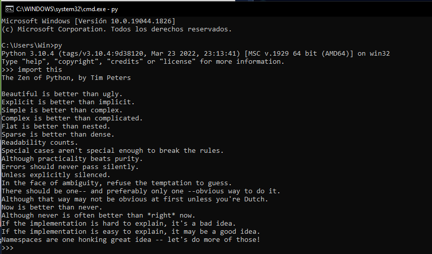

### ¿Qué es la documentación?
- Informacion que nos explica como funciona determinado leguaje o tecnologia: 
    - Consultar informacion clara y directa
    - Tener ejemplo de los mismos desarrolladores
    - Referencias de todas las caracteristicas y funcionalidades en un solo lugar
    - Conocer los nuevos features de nuevas actualizaciones
    - Conocer el modo de empleo de versiones anteriores
    - Aprender a manejar correctamente las herramientas
    - Que contienen los modulos integrados dentro de python
    - Como manejar los modulos
    - Manejo y uso de frameworks
    - Ser autodidacta

- una herramienta por si no les gusta leer la documentación desde la página o prefieren ir documentándose mientras programan 😉 les recomiendo que usen ***Kite*** que les brinda la documentación de cada función que escriban en su código con solo poner el cursor encima.

### ¿Qué es un entorno virtual?
- Los entornos virtuales son de mucha utilidad ya que nos ayudan a tener versiones especificas de librerías o módulos a un proyecto sin afectar a otros. De esta forma en el mismo equipo pueden coexistir distintos proyectos con distintas versiones de la misma librería o modulo.
- Sin usar entorno virtual:
- 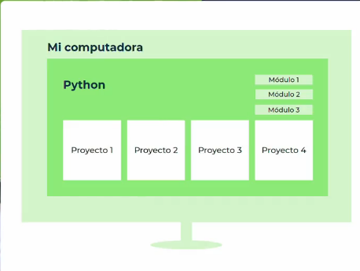
- Usando entorno virtual:
- 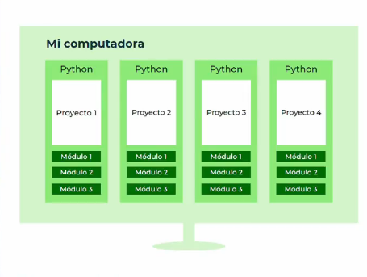

### creación de un entorno virtual
- py = python3
- -m = indicativo = un modulo
- venv = virtual enviroment = ambiente virtual
- venv = es el nombre le podemos poder cualquiera
- 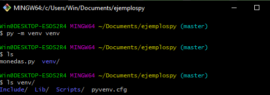
- 
- Finalizamos con la creacion de un entorno virtual
- alt + 92 creamos el ***backslash*** \
### Instalación de dependencias con pip
- Pip (package installer for python) Nos permite descargar paquetes de terceros para utilizarlos en nuestro enviroment, ademas se puede definir una versión especifica del paquete.
  - pip install <paquete> instala el paquete(pandas , matplotlib, bokeh, etc) que se especifique

  - pip freeze muestra todos los paquetes instalados en tu ambiente virtual

- Si quisiéramos que alguien mas pueda ejecutar nuestro proyecto es importante compartir que librería y versión hemos empleado; eso se realiza con el comando:
  - pip freeze > requirements.txt

- El resultado de pip freeze se escribe en requirements.txt (puedes usar otro nombre pero el mostrado es una buena practica)para instalar paquetes desde un archivo como requirements.txt ejecutamos:
  - pip install -r requirements.txt 
## CursoProfesionaldePython

### Cómo organizar las carpetas de tus proyectos
- Un módulo es cualquier archivo de Python. Generalmente, contiene código que puedes reutilizar.

- 🗄 Un paquete es un conjunto de módulos. Siempre posee el archivo __init__.py.
Una ejemplo de organizar los archivos de 🐍Python es de la siguiente manera.
- 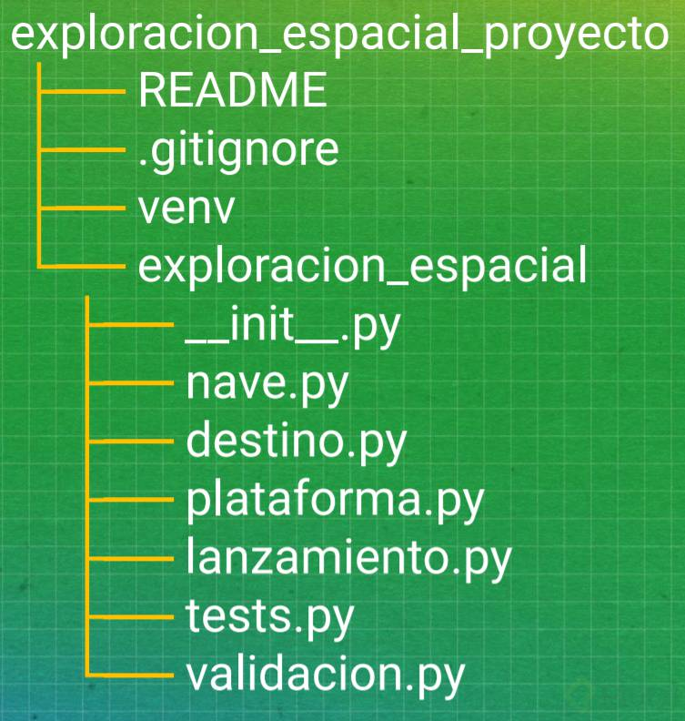

### ¿Qué son los tipados?

- 💻 Los tipados es una clasificación de los lenguajes de programación, tenemos cuatro tipos:

   - Estático
   - Dinámico
   - Débil
   - Fuerte
   - El tipado del lenguaje depende de cómo trata a los tipos de datos.

- El tipado estático es el que levanta un error en el tiempo de compilación, ejemplo en JAVA:
    ```bash
        String str = "Hello" // Variable tipo String
        str = 5 // ERROR: no se puede convertir un tipo de dato en otro de esta forma.
    ```
- El tipado dinámico levantan el error en tiempo de ejecución, ejemplo en Python:
     ```bash
        str = "Hello" # Variable tipo String
        str = 5 # La variable ahora es de tipo Entero, no hay error

        ## TIPADO FUERTE
        x = 1
        y = "2"
        z = x + y # ERROR: no podemos hacer estas operaciones con tipos de datos distintos entre sí
    ```
- El tipado débil es el que hace un cambio en un tipo de dato para poder operar con el, como lo hace JavaScript y PHP.

- 🐍 Python es un lenguaje de tipado 👾 Dinámico y 💪 Fuerte.
- 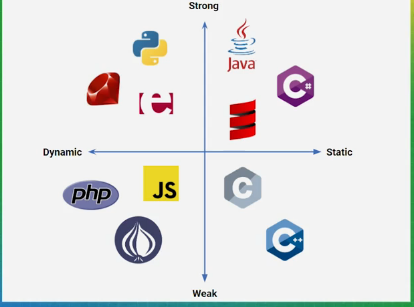
### Closures
- Es una forma de acceder a variables de otros scopes a través de una nested function. Se retorna la nested function y esta recuerda el valor que imprime, aunque a la hora de ejecutarla no este dentro de su alcance.
- reglas para encontrar un closure:
   - debemos tener una nested function (funciones anidadas)
   - la nested function debe referenciar un valor de un scope superior
   - la función que envuelve la nested debe retornarla también
   - cuando tenemos una clase que tiene solo un método
   - cuando trabajamos con decoradores
## Git
- Git es un sistema de control de versiones distribuido, diseñado por Linus Torvalds. Está pensando en la eficiencia y la confiabilidad del mantenimiento de versiones de aplicaciones cuando estas tienen un gran número de archivos de código fuente.

  - Git está optimizado para guardar cambios de forma incremental.

  - Permite contar con un historial, regresar a una versión anterior y agregar funcionalidades.

  - Lleva un registro de los cambios que otras personas realicen en los archivos.

- Git fue diseñado para operar en un entorno Linux. Actualmente, es multiplataforma, es decir, es compatible con Linux, MacOS y Windows. En la máquina local se encuentra Git, se utiliza bajo la terminal o línea de comandos y tiene comandos como merge, pull, add, commit y rebase, entre otros.

- Para qué proyectos sirve Git
  - Con Git se obtiene una mayor eficiencia usando archivos de texto plano, ya que con archivos binarios no puede guardar solo los cambios, sino que debe volver a grabar el archivo completo ante cada modificación, por mínima que sea, lo que hace que incremente demasiado el tamaño del repositorio.
- 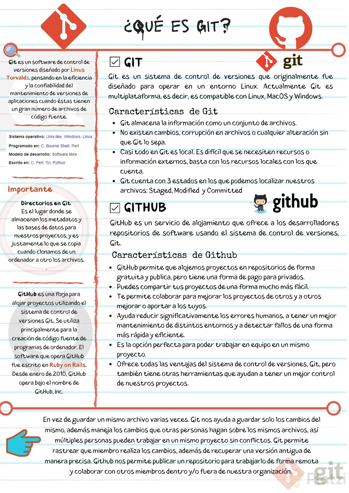
### Instalando Git y GitBash en Windows
- Para instalar este sistema de control de versiones en Windows, simplemente vas al repositorio de descarga. Luego de descargarlo, lo ejecutas como cualquier otra aplicación de Windows.

- Al momento de iniciar el instalador, asegúrate de haber marcado la opción de instalar Git Bash en el computador (que es lo que nos permitirá correr comandos de Linux en la consola sin problemas para trabajar con Git).
- 
- https://git-scm.com/downloads
### Instalando Git en Linux
- Cada distribución de Linux tiene un comando especial para instalar herramientas y actualizar el sistema. Aquí veremos un ejemplo de los comandos para instalar Git en Linux
    ```bash
    sudo apt-get update
    sudo apt install git
    git --version
    ```
- Sudo significa Super User DO. Se utiliza para correr comandos con credenciales de super usuario (sin restricciones).

- En las distribuciones derivadas de Debian (como Ubuntu) el comando especial es apt-get, en Red Hat es yum y en ArchLinux es pacman. Cada distribución tiene su comando especial y debes averiguar cómo funciona para poder instalar Git.

- Antes de hacer la instalación, debemos hacer una actualización del sistema. En nuestro caso, los comandos para hacerlo son sudo apt-get update y sudo apt-get upgrade.

- Con el sistema actualizado, ahora sí podemos instalar Git y, en este caso, el comando para hacerlo es sudo apt-get install git. También puedes verificar que Git fue instalado correctamente con el comando git --version.

### terminal y línea de comandos
    - pwd: Nos muestra la ruta de carpetas en la que te encuentras ahora mismo.
    mkdir: Nos permite crear carpetas (por ejemplo, mkdir Carpeta-Importante).
    touch: Nos permite crear archivos (por ejemplo, touch archivo.txt).
    rm: Nos permite borrar un archivo o carpeta (por ejemplo, rm archivo.txt). Mucho cuidado con este comando, puedes borrar todo tu disco duro.
    cat: Ver el contenido de un archivo (por ejemplo, cat nombre-archivo.txt).
    ls: Nos permite cambiar ver los archivos de la carpeta donde estamos ahora mismo. Podemos usar uno o más argumentos para ver más información sobre estos archivos (los argumentos pueden ser -- + el nombre del argumento o - + una sola letra o shortcut por cada argumento).
        - ls -a: Mostrar todos los archivos, incluso los ocultos.
        - ls -l: Ver todos los archivos como una lista.
    cd: Nos permite navegar entre carpetas.
        - cd /: Ir a la ruta principal:
        - cd o cd ~: Ir a la ruta de tu usuario
        - cd carpeta/subcarpeta: Navegar a una ruta dentro de la carpeta donde estamos ahora mismo.
        - cd .. (cd + dos puntos): Regresar una carpeta hacia atrás.
    - Si quieres referirte al directorio en el que te encuentras ahora mismo puedes usar cd . (cd + un punto).
    history: Ver los últimos comandos que ejecutamos y un número especial con el que podemos repetir su ejecución.
    ! + número: Ejecutar algún comando con el número que nos muestra el comando history (por ejemplo, !72).
    clear: Para limpiar la terminal. También podemos usar los atajos de teclado Ctrl + L o Command + L.

### Utilizando git y github en la vida real
- Primero entrar a la carpeta del proyecto ojo "Tenemos que tener una cuenta en github y descargar git como tambien habilitar en el path" y creamos el repositorio en github.Luego poner estos comandos :

  -  git config --global user.email "you@example.com"
  -  git config --global user.name "Your Name"
  -  git init (Sirver para crear un init en la carpeta del proyecto " es como un repositorio de Db")
  -  git remote add origin link (en la aprte del link pegar el repositorio creado en github)
  -  git status ( para ver los archivos estaran de color rojo)
  -  git add * ( para agregar todos los achivos y enter)
  -  git status ( y se pondra ahora de verde todo)
  -  git commit -m "aqui frase" (en aqui frase poner ejemplo version 1 = sirve para ver los cambios)
  -  git push origin master ( para subirpor fin todos los archivos)
  -  aveces no funiona porque debe a ver almenos una en blanco de notepad o .txt Y ve a tus REPOSITORIO en -GITHUB y observaras que ya se subio todo los archivos
- 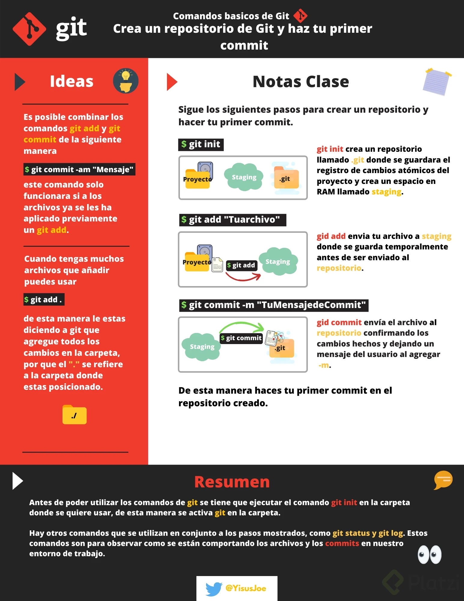
### Utilizando git, github y gitkraken en la vida real parte 2
- 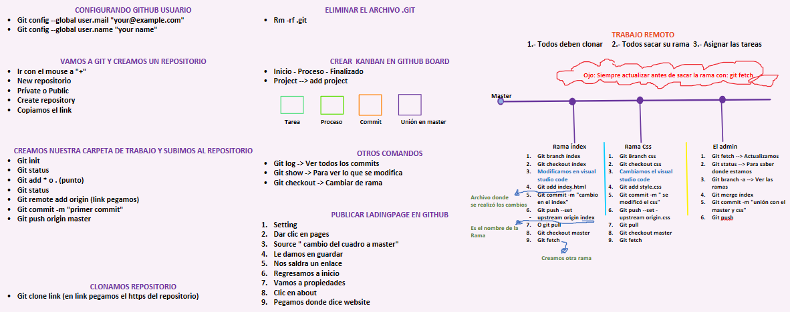

- ***Salimos de git con la letra Q***
### ¿Qué es el staging?
El staging es el lugar donde se guardan temporalmente los cambios, para luego ser llevados definitivamente al repositorio. El repositorio es el lugar donde se guardan todos los registros de los cambios realizados a los archivos.

- Para iniciar un repositorio, o sea, activar el sistema de control de versiones de Git en tu proyecto, solo debes ejecutar el comando git init.

¿Qué es el área de staging?
- El área de staging se puede ver como un limbo donde nuestros archivos están por ser enviados al repositorio o ser regresados a la carpeta del proyecto.

¿Qué es git init?
- git inites el comando que activa git en nuestro proyecto creando un espacio en memoria RAM llamado staging y una carpeta .git.
- 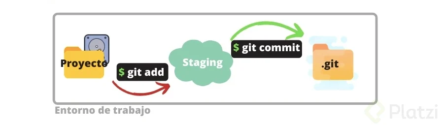
### ¿Qué es branch (rama) y cómo funciona un Merge en Git?
- Una rama o branch es una versión del código del proyecto sobre el que estás trabajando. Estas ramas ayudan a mantener el orden en el control de versiones y manipular el código de forma segura.
- 
***Cómo crear un branch o rama en Git***
- El comando git branch permite crear una rama nueva. Si quieres empezar a trabajar en una nueva función, puedes crear una rama nueva a partir de la rama master con git branch new_branch. Una vez creada, puedes usar git checkout new_branch para cambiar a esa rama.

- Recuerda que todas tus versiones salen de la rama principal o Master y de allí puedes tomar una versión específica para crear otra rama de versiones.

***Cómo hacer merge***
- Producir una nueva rama se conoce como Checkout. Unir dos ramas lo conocemos como Merge.

- Cuando haces merge de estas ramas con el código principal, su código se fusiona originando una nueva versión de la rama master (o main) que ya tiene todos los cambios que aplicaste en tus experimentos o arreglos de errores.

## Terminal
***¿Qué es la terminal?***
- La terminal es un programa que ejecuta líneas de comandos, que a su vez estas líneas de comando ejecutan acciones y aquí tienes que aprender dos conceptos: terminal y shell.

## Anaconda
- 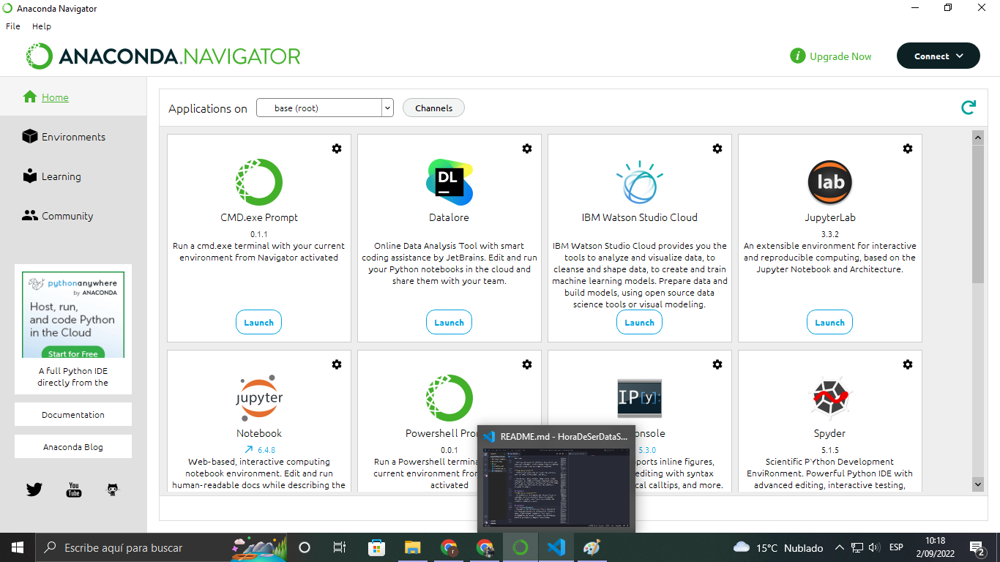 
- Anaconda es una distribución libre y abierta​ de los lenguajes Python y R, utilizada en ciencia de datos, y aprendizaje automático. Esto incluye procesamiento de grandes volúmenes de información, análisis predictivo y cómputos científicos.
- Instalando otras librerias de graficos:
- Primero nos vamos al ***anaconda prompt***
- finalmente ponemos: ***conda install matplotlib***
- 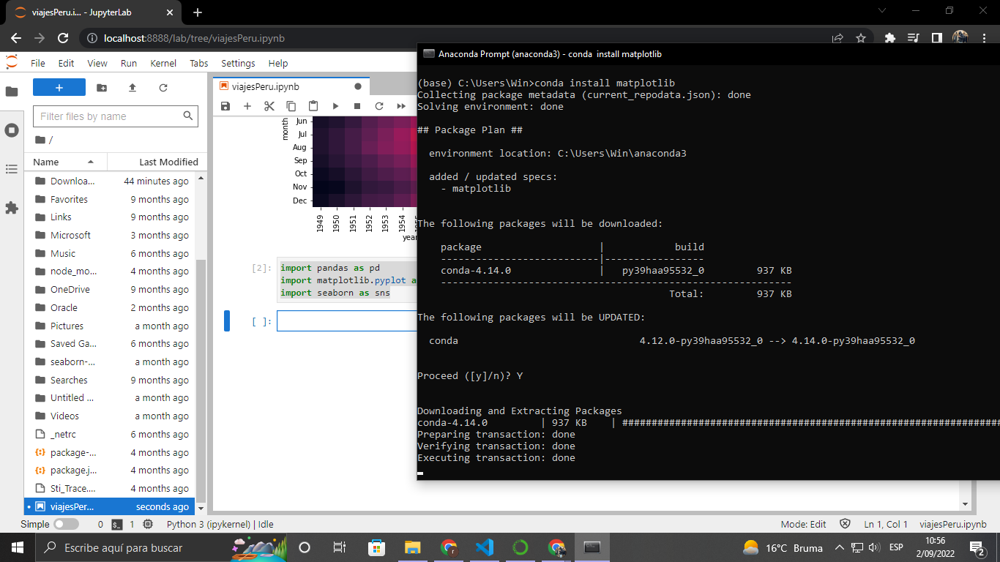 
### Utilizando graficas con libreria SEABORN
- Importamos un data set: 
    ```py
    from sklearn.datasets import load_iris
    ```
- 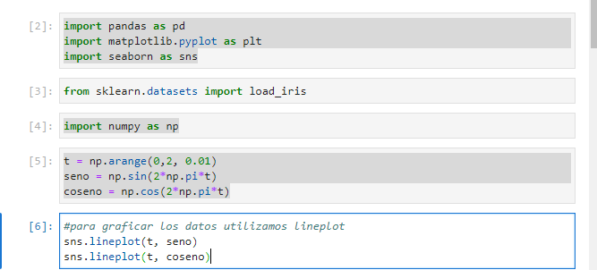 
- 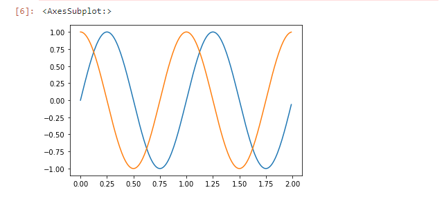 
- Luego tambien tenemos graficas como:
  -  barplot
  -  boxplot
  -  iolinplot
  -  matriz para heat map
  -  eatmap

### Etapas del proceso de desarrollo de software
- El proceso de desarrollo tradicional tiene etapas muy marcadas, que tienen entradas, procesos y salidas que funcionan como entradas de la siguiente etapa.
  - Análisis de requerimientos: Todo nace de un disparador que nos crea la necesidad de crear un artefacto o un sistema.
    - Necesitamos entender cuál es el problema que queremos resolver. Hay requerimientos de negocio, requerimientos funcionales, requerimientos no funcionales.
    - Al terminar esta etapa debemos tener una comprensión bastante clara del problema que vamos a resolver.
  - Diseño de la solución: Análisis profundo de los problemas para trabajar en conjunto y plantear posibles soluciones. El resultado de esto debe ser el detalle de la solución, a través de requerimientos, modelado (UML), documentació. Resuelve preguntas tales como:
    ¿Cómo va el usuario a utilizar la aplicación?
    ¿Como se va a implementar la aplicación en producción y como será esto administrado?
    ¿Cuales son los atributos requeridos por la aplicación? (rendimiento, seguridad, concurrencia, internacionalización, configuración)
    ¿Cómo se puede diseñar la aplicación para que sea mantenible y flexible con el paso del tiempo?
    ¿Cuales son las tendencias a nivel de arquitectura que pueden afectar la aplicación actualmente o una vez que ha sido implantada?
    ¿Cuáles son las partes fundamentales de la arquitectura que representan el riesgo más grande si se hacen mal?
    -¿Cuáles son los principales supuestos y como van a ser probados?
    ¿Cuáles son las partes de la arquitectura que tienen más probabilidad de cambiar?
    ¿Qué condiciones pueden llevar a que se tenga que refactorizar el diseño realizado?
    ¿Porqué es esta la mejor opción de arquitectura?
    ¿Qué medidas estamos tomando para mitigar los riesgos?
  - Desarrollo y evolución: Implementación de la solución, para garantizar que lo que se esta construyendo es lo que se espera. Al finalizar esta etapa tendremos un artefacto de software.
     - Es donde plasmamos en “código” las dos anteriores etapas, ademas de realizar test a dicho código. Debemos tener claros cuales son los criterios de aceptación de la solución, osea cual es el set de requerimientos necesario para construir esta solución y como hacemos para evaluarlos (TDD), el resultado de esta etapa es un artefacto de software.
  - Despliegue: Aquí vamos a necesitar de infraestructura y de roles de operación para poder poner el artefacto a disponibilidad.
     - Debemos implementar la solución (artefacto) que ya tenemos construida en productivo, AWS, GCP, Heroku, github-pages, hosting, play store, etc
  - Mantenimiento y evolución: Desarrollo + despliegue + mantenimiento, en esta etapa estamos atentos a posible mejoras que se hacen al sistema. En esta etapa el software se mantiene hasta que el software ya deja de ser necesario.
## Excel
- En Microsoft Excel, como en muchos otros programas, se manejan comandos especiales para que tu interacción dentro del libro de trabajo sea más fluida y rápida. Al comienzo, siempre aprendemos ejecutando acciones con el puntero del mouse, pero poco a poco y sin presionarte puedes ir intentando las siguientes combinaciones hasta que las ejecutes incluso sin notarlo y sin tener que pensarlas una a una.
  - excelente aportación, aunque en la práctica hay un par que uso mucho y que serían de ayuda:
     -   Buscar: Ctrl + b
     -   Reemplazar: Ctrl + L
     -   Agrupar: Ctrl + Shift + flecha derecha
     -   Desagrupar: Ctrl + Shift + flecha izquierda
     -   Formato de Celdas: Ctrl + 1 (la tecla 1 del teclado alfanumérico, con el del teclado numérico no funciona)
     -   Ocultar Fila: Ctrl + 9
     -   Ocultar Columna: Ctrl + 0
### Importar datos y crear nuevos archivos
- como importar un archivo txt a excel
  - 1.- Archivos
  - 2.- Abrir
  - 3.- Examinar
  - 4.- Todos los archivos

### Consulta información con BUSCARV
- BUSCARV solo funciona cuando la informacion buscada esta despues del valor de referencia entre las dos tables. En este caso,
La columan Product_id debe estar primero que Vendor_id.
De lo contrario, dara un error. Esto es una limitacion de esta formula
- ***F2*** Nos muestra la formula
- ***F4*** Sirve para fijar
- 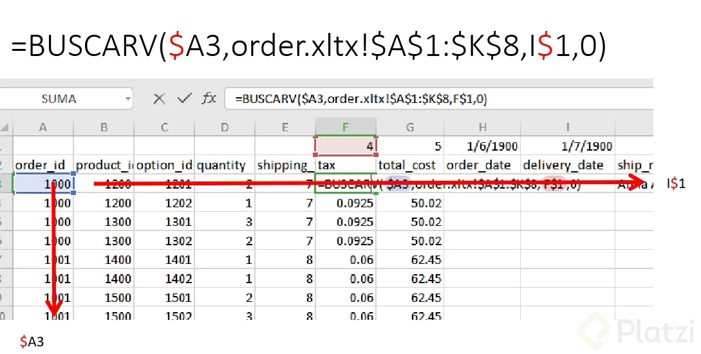
- $ fijamos una fila cuando es antes de la A3 

### comandos muy usados
- ctl + sirve para agregar una nueva fila
- ctl - sirve para eliminar una fila
- ctl + barra espaciadora sirve para seleccionar una columna

### Consultas horizontales con BUSCARH y tipos de errores en fórmulas
- 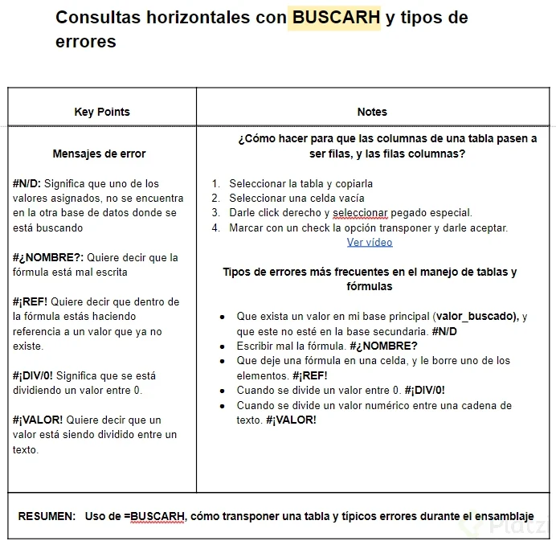
- Hacer clic en la celda donde se desea escribir un valor de búsqueda.
- Introducir un valor para buscar.
- Hacer clic en Introducir o presionar Enter.
- Hacer clic en la celda donde se desea agregar la función BUSCARH.
- Hacer clic en el botón Insertar función. ...
- Seleccionar la función BUSCARH

## PostgreSQL

### Curso de PostgreSQL

### Curso de PostgreSQL Aplicado a Ciencia de Datos

### Curso de Backend con Node.js: Base de Datos con PostgreSQL
